# Netdata, alertes i nmap  <!-- omit in toc -->

Activitat: Crea una alerta per detectar un escanig de més de 100 ports.

# Índex  <!-- omit in toc -->

- [1. Primer investiga què és un TCP Reset. Fes-ne una petita explicació i digue’s en quins casos s’utilitza.](#1-primer-investiga-què-és-un-tcp-reset-fes-ne-una-petita-explicació-i-digues-en-quins-casos-sutilitza)
- [2. El Netdata té alarmes creades per detectar TCP resets. Estan definides al fitxer *tcp_resets.conf*. Prova de fer nmaps a la teva màquina on hi tens el Netdata. Adjunta una captura de l’alerta que has rebut.](#2-el-netdata-té-alarmes-creades-per-detectar-tcp-resets-estan-definides-al-fitxer-tcp_resetsconf-prova-de-fer-nmaps-a-la-teva-màquina-on-hi-tens-el-netdata-adjunta-una-captura-de-lalerta-que-has-rebut)
- [3. Després d’estudiar i entendre com funcionen les alarmes creades per Netdata sobre TCP resets, crea una alerta al mateix fitxer *tcp_resets.conf* que comenci amb el teu nom (per exemple elteunom_mes_de_100_TCP_Resets) i que t’avisi quan la teva màquina enviï més de 100 tcp resets seguits. Adjunta una captura de l’alerta que acabes de fer.](#3-després-destudiar-i-entendre-com-funcionen-les-alarmes-creades-per-netdata-sobre-tcp-resets-crea-una-alerta-al-mateix-fitxer-tcp_resetsconf-que-comenci-amb-el-teu-nom-per-exemple-elteunom_mes_de_100_tcp_resets-i-que-tavisi-quan-la-teva-màquina-enviï-més-de-100-tcp-resets-seguits-adjunta-una-captura-de-lalerta-que-acabes-de-fer)
- [4. Adjunta una captura de la teva alerta que has rebut per correu electrònic.](#4-adjunta-una-captura-de-la-teva-alerta-que-has-rebut-per-correu-electrònic)
- [5. Completa el teu exercici utilitzant el Wireshark amb el filtre adequat per obtenir la IP de la màquina que t’està fent l’nmap. Adjunta també una captura amb el filtre i la IP de l’atacant.](#5-completa-el-teu-exercici-utilitzant-el-wireshark-amb-el-filtre-adequat-per-obtenir-la-ip-de-la-màquina-que-testà-fent-lnmap-adjunta-també-una-captura-amb-el-filtre-i-la-ip-de-latacant)

## 1. Primer investiga què és un TCP Reset. Fes-ne una petita explicació i digue’s en quins casos s’utilitza.

Un TCP Reset és un paquet, també anomenat segment, que s'utilitza en el protocol TCP per reiniciar la connexió.

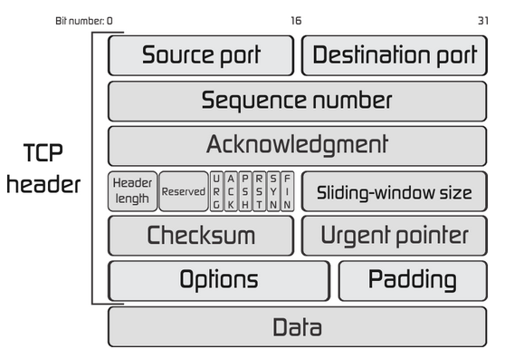

Imatge extreta de: https://fiberbit.com.tw/tcp-transmission-control-protocol-segments-and-fields/

Dins del segment trobem a la capçalera el camp *flags*, dividit en 6 bits. Aquests bits són els que ens trobem a la imatge:

* URG
* ACK
* PSH
* RST
* SYN
* FIN

Quan el bit RST té valor 1, el paquet està demanant que cal reiniciar la connexió. S'utilitza quan es vol rebutjar un intent de connexió. 

Hi ha un tipus de ciberatac on s'utilitza aquesta funcionalitat. Aquest atac és el que fan servir països com China o Iran per interferir i bloquejar les connexions per tal de censurar internet.

Quan es troben molts TCP Resets pot indicar que s'està realitzant un escaneig de ports.


## 2. El Netdata té alarmes creades per detectar TCP resets. Estan definides al fitxer *tcp_resets.conf*. Prova de fer nmaps a la teva màquina on hi tens el Netdata. Adjunta una captura de l’alerta que has rebut.

Aquestes són les configuracions de les alertes del Netdata:

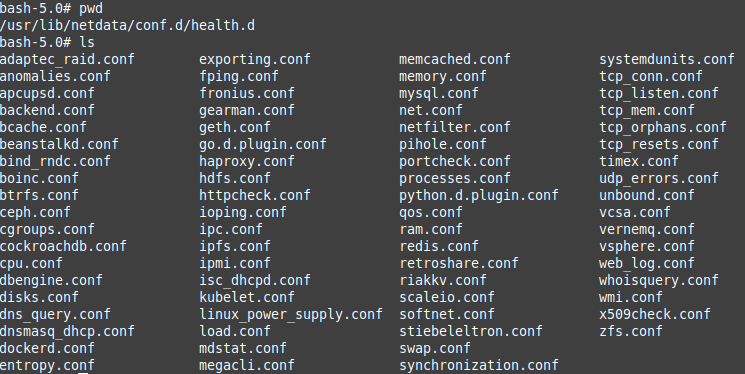

Contingut del fitxer *tcp_resets.conf*:
```
# you can disable an alarm notification by setting the 'to' line to: silent

# -----------------------------------------------------------------------------
# tcp resets this host sends

    alarm: 1m_ipv4_tcp_resets_sent
       on: ipv4.tcphandshake
    class: Errors
     type: System
component: Network
       os: linux
    hosts: *
   lookup: average -1m at -10s unaligned absolute of OutRsts
    units: tcp resets/s
    every: 10s
     info: average number of sent TCP RESETS over the last minute

    alarm: 10s_ipv4_tcp_resets_sent
       on: ipv4.tcphandshake
    class: Errors
     type: System
component: Network
       os: linux
    hosts: *
   lookup: average -10s unaligned absolute of OutRsts
    units: tcp resets/s
    every: 10s
     warn: $this > ((($1m_ipv4_tcp_resets_sent < 5)?(5):($1m_ipv4_tcp_resets_sent)) * (($status >= $WARNING)  ? (1) : (20)))
    delay: up 20s down 60m multiplier 1.2 max 2h
  options: no-clear-notification
     info: average number of sent TCP RESETS over the last 10 seconds. \
           This can indicate a port scan, \
           or that a service running on this host has crashed. \
           Netdata will not send a clear notification for this alarm.
       to: sysadmin

# -----------------------------------------------------------------------------
# tcp resets this host receives

    alarm: 1m_ipv4_tcp_resets_received
       on: ipv4.tcphandshake
    class: Errors
     type: System
component: Network
       os: linux freebsd
    hosts: *
   lookup: average -1m at -10s unaligned absolute of AttemptFails
    units: tcp resets/s
    every: 10s
     info: average number of received TCP RESETS over the last minute

    alarm: 10s_ipv4_tcp_resets_received
       on: ipv4.tcphandshake
    class: Errors
     type: System
component: Network
       os: linux freebsd
    hosts: *
   lookup: average -10s unaligned absolute of AttemptFails
    units: tcp resets/s
    every: 10s
     warn: $this > ((($1m_ipv4_tcp_resets_received < 5)?(5):($1m_ipv4_tcp_resets_received)) * (($status >= $WARNING)  ? (1) : (10)))
    delay: up 20s down 60m multiplier 1.2 max 2h
  options: no-clear-notification
     info: average number of received TCP RESETS over the last 10 seconds. \
           This can be an indication that a service this host needs has crashed. \
           Netdata will not send a clear notification for this alarm.
       to: sysadmin
```

> He provat vàries vegades a fer aquesta prova amb la instal·lació feta amb Docker, amb diferents configuracions pel contenidor i en diferents màquines.
> 
> No he estat capaç de poder fer la prova amb èxit.
> \
> \
> Finalment he fet la prova amb la instal·lació comuna, sense fer servir Docker i m'ha funcionat la prova.
> No investigaré el motiu pel qual no funcionava amb Docker i directament faré servir el Netdata que he instal·lat amb la comanda:
> ```
> bash <(curl -Ss https://my-netdata.io/kickstart.sh) --claim-token iCheH8mEpkkvtXbVAXkimEXdqUU-TwFmuPSbxrflzffz762tEh6ihTuXymdhQy7qurIUZpF0_Ek_Ti6nE5KYW4H-xqdITU5EaQCJ-iXslORqilzIzci_ICbXhQCVMa-CMd_EWIk --claim-rooms 80859831-206c-4ade-8381-564f89751c9c --claim-url https://app.netdata.cloud
> ```

Com a sudo:
```bash
# Faig un bucle amb nmap -sS (sondeig TCP SYN)
# Primer ho he provat des de la mateixa màquina amb localhost
while true; do nmap -sS localhost; done

# Després ho he provat des d'una altra màquina.
while true; do nmap -sS 192.168.1.19; done
```


Moment en que salta l'alerta:

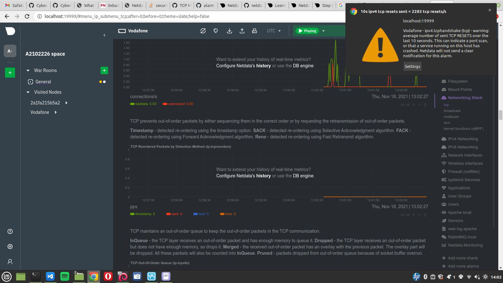

A les següents captures es poden veure dos moments amb incidències, fent que salti l'alerta dues vegades, per l'intent fet en la mateixa màquina i en l'altra màquina en local.
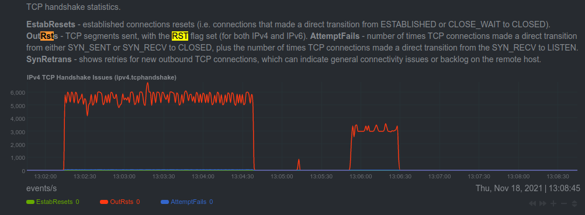
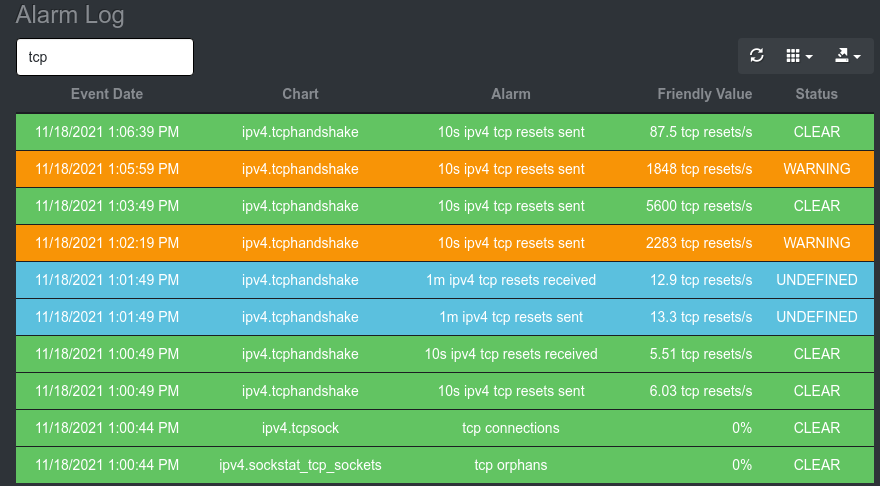


Aquest és el correu rebut amb l'alerta:

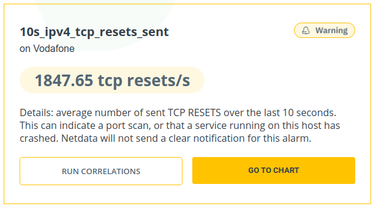
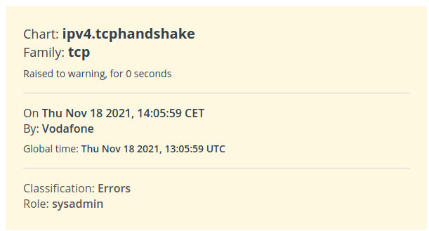

## 3. Després d’estudiar i entendre com funcionen les alarmes creades per Netdata sobre TCP resets, crea una alerta al mateix fitxer *tcp_resets.conf* que comenci amb el teu nom (per exemple elteunom_mes_de_100_TCP_Resets) i que t’avisi quan la teva màquina enviï més de 100 tcp resets seguits. Adjunta una captura de l’alerta que acabes de fer. 

>Com a mínim ha de contenir:
>* alarm: el nom de la teva alarma
>* on: ipv4.tcphandshake
>* lookup: el teu càlcul
>* warn: la teva alerta
>* info: missatge d’alerta que vols rebre
>* to: sysadmin
>
> Quan crees una alarma, pots reiniciar el servei amb: sudo netdatacli reload-health

```bash
# Editem el fitxer per afegir alerta.
sudo vi /usr/lib/netdata/conf.d/health.d/tcp_resets.conf

# Toni Peraira Alert
# Cada 100 TCP Resets en 5 segons, salta l'alerta amb estat WARNING.
# Si arriben a 1000, salta l'alerta amb estat crític.
    alarm: toni_peraira_mes_de_100_TCP_Resets                                                       
       on: ipv4.tcphandshake                                                              
    class: Errors                                                                         
     type: System                                                                         
component: Network                                                                        
       os: linux                                                                          
    hosts: *                                                                              
   lookup: sum -5s unaligned absolute of OutRsts                                     
    units: tcp resets/s                                                      
     warn: $this > 100    
     crit: $this > 1000
     info: more than 100 TCP resets have been sent in a row, \
            over the last 5 seconds. \                  
            This can indicate a port scan, \                                               
            or that a service running on this host has crashed.                  
       to: sysadmin  
```

```bash
# Reiniciem
sudo netdatacli reload-health
```

Informació de l'alerta en Netdata:

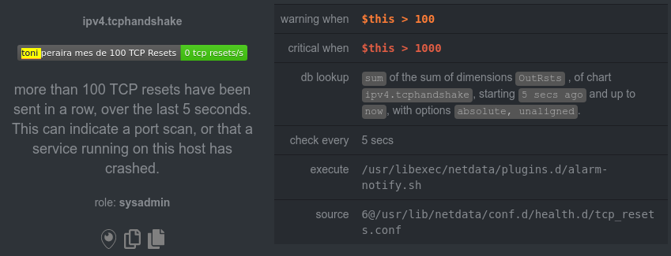

## 4. Adjunta una captura de la teva alerta que has rebut per correu electrònic.

Logs de l'alerta:

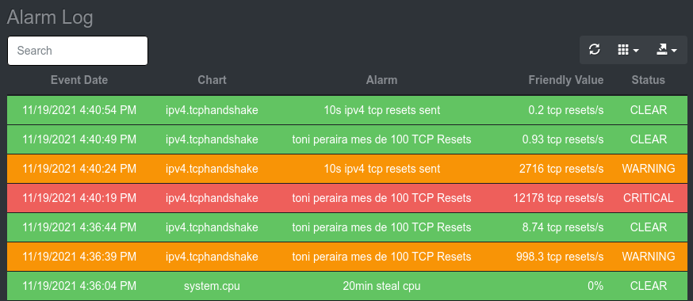

Moment en que salta una notificació d'alerta crítica:

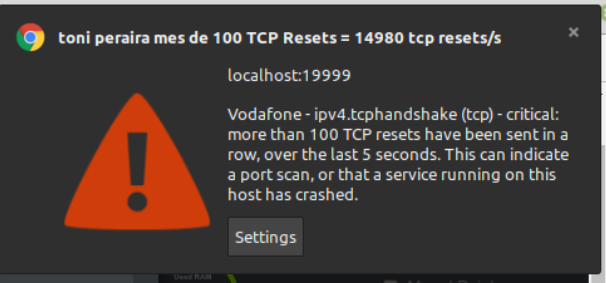

Moment en que salta una notificació que tot ha tornat a la normalitat:

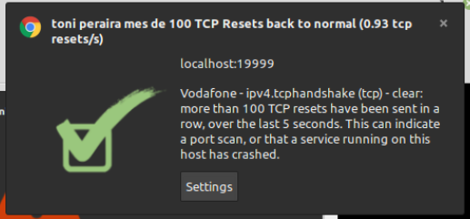

Correus rebuts:


Correu amb l'alerta crítica:

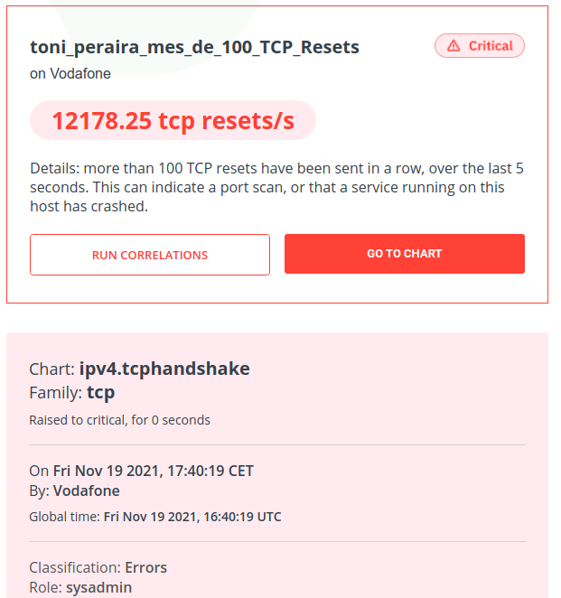

## 5. Completa el teu exercici utilitzant el Wireshark amb el filtre adequat per obtenir la IP de la màquina que t’està fent l’nmap. Adjunta també una captura amb el filtre i la IP de l’atacant.

Hi ha moltes formes de filtrar el Wireshark per detectar un possible escaneig de ports.

He fet servir el filtre:

```
tcp && tcp.flags.reset == 1 && tcp.window_size <=1024 && ip.src == 192.168.2.119
```
On:

> * tcp: Filtrem pel protocol TCP.
> 
> * tcp.flags.reset == 1: Com estem fent exercicis sobre TCP Resets, filtrem pel *flag reset*, el qual hem descrit al principi.
> 
> * tcp.windows_size <= 1024: L'escaneig de ports amb Nmap o altres eines no envien gaires dades, únicament envia les dades essencials per comprovar que existeix el port. Amb aquest filtre, filtrem paquets de poca grandària.
> 
> ip.src == 192.168.2.119: És la IP de la màquina que rep l'escaneig de ports. 


Aquí es mostren alguns filtres d'utilitat:

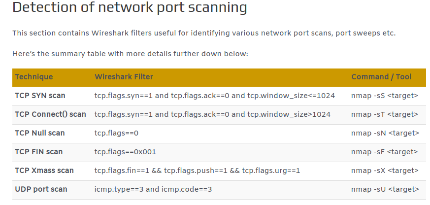

Imatge extreta de: https://www.infosecmatter.com/detecting-network-attacks-with-wireshark/

Aquí tenim el filtre preparat, però no hem executat l'escaneig de ports encara:
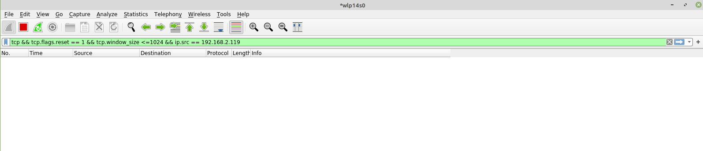

En el moment en què executem l'escaneig de ports ja comencem a veure tots aquells TCP Resets que han succeït després de l'intent d'escaneig per part de la IP **192.168.2.196**, que és la meva màquina atacant:
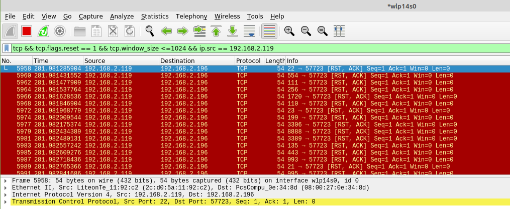