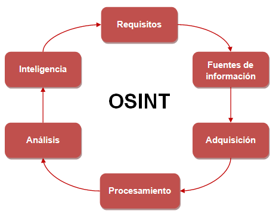

<!-----
title: "OSINT"
author: "Toni Peraira"
date: "2021-11-22"
version: "1.0"
geometry: left=2.54cm,right=2.54cm,top=2.54cm,bottom=2.54cm
header-right: '\headerlogo'
header-includes:
- '`\newcommand{\headerlogo}{\raisebox{0pt}[0pt]{\includegraphics[width=3cm]{../institut_montilivi.png}}}`{=latex}'
---

<!--
pandoc README.md -o Toni_Peraira_OSINT.pdf --from markdown --template eisvogel --listings --pdf-engine=xelatex
-->

# OSINT  <!-- omit in toc -->

Llegeix el document -> https://www.incibe-cert.es/blog/osint-la-informacion-es-poder

# Índex  <!-- omit in toc -->

- [1. Descriu breument què és OSINT.](#1-descriu-breument-què-és-osint)
- [2. En aquest artícle s'hi llisten certes fases, comenta què entens per cada una d'elles i com ho faries o a qui demanaries ajuda per aconseguir realitzar-la.](#2-en-aquest-artícle-shi-llisten-certes-fases-comenta-què-entens-per-cada-una-delles-i-com-ho-faries-o-a-qui-demanaries-ajuda-per-aconseguir-realitzar-la)

# 1. Descriu breument què és OSINT.

OSINT (Open Source Intelligence) és tota aquella informació que es pot obtenir de fonts públiques d'internet. 

Totes aquelles dades que es troben a la xarxa de forma pública, és coneixement que es pot recopilar per qualsevol persona. A partir d'eines i tècniques, podem recopilar aquesta informació per fer anàlisis i relacions de dades.
Això ens permet per exemple fer investigacions, estudis, saber informació d'empreses i els seus treballadors, accedir a sistemes de control, etc.

# 2. En aquest artícle s'hi llisten certes fases, comenta què entens per cada una d'elles i com ho faries o a qui demanaries ajuda per aconseguir realitzar-la. 

1. **Requisits:**

    És el moment en què qüestionem quines dades necessitem, per què les necessitem i com les podem obtenir. És a dir, quins requisits cal complir per buscar i obtenir les dades.

    Si haig de presentar un problema que necessita una solució, sé millor que ningú quin problema és, no cal ajuda.

2. **Identificar fonts d'informació:**

    La fase en què es busquen les fonts que ens donaran la informació que busquem. Es mira de buscar fonts que siguin fiables i amb veracitat.

    Ens podríem ajudar d'un investigador, algú que investiga ha d'estar acostumat a trobar fonts fiables, dic jo.

    Una forma d'identificar fonts d'informació fiables, és contrastar la informació amb diversos llocs.

    Amb un buscador com Google i sabent explotar les seves eines puc trobar amb exactitud el que busco.

    Una informació que no sigui certa ens alterarà els resultats i no seran correctes.

3. **Adquisició:**
   
    És quan obtenim la informació de les fonts trobades.

    Per adquirir la informació podria fer servir alguna eina de còpia de webs per tenir emmagatzemada tota la informació i no perdre'm res.

4. **Procesament:**

    És aquella fase on organitzem la informació adquirida per poder fer el posterior anàlisi. De la ingent quantitat d'informació trobada, es fa un procés de selecció.

    És com quan un estudiant que està preparant un examen passa els seus apunts a en blanc, per sintetitzar i entendre-ho millor i tenir més fàcil la següent fase.

    Com tinc la informació descarregada en format HTML, podria crear un script per processar les dades a partir de les meves necessitats, per no tenir una feina tan exhaustiva.

5. **Anàlisi:**

    En aquesta fase és on s'aplica aquesta intel·ligència de l'OSINT per trobar relacions. És quan arribem a les conclusions que buscàvem quan vam començar la cerca d'informació.

    Un analista OSINT segur que ens podria ajudar a fer l'anàlisi, es dediquen a això.

6. **Presentació d'intel·ligència:**

    La fase final on li donem un format a la informació trobada. Transformem la informació perquè sigui fàcil i ràpid de buscar i comprendre. Es presenta buscant la màxima eficàcia. 
    
    Com quan un estudiant ha de presentar un treball i crea una presentació amb diapositives, on la informació sintetitzada al màxim per poder explotar-la a l'hora de presentar-la.

    Jo mateix podria fer aquesta fase, sé fer Power Points molt guais.