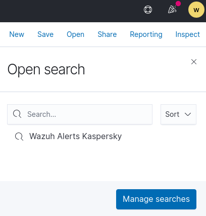
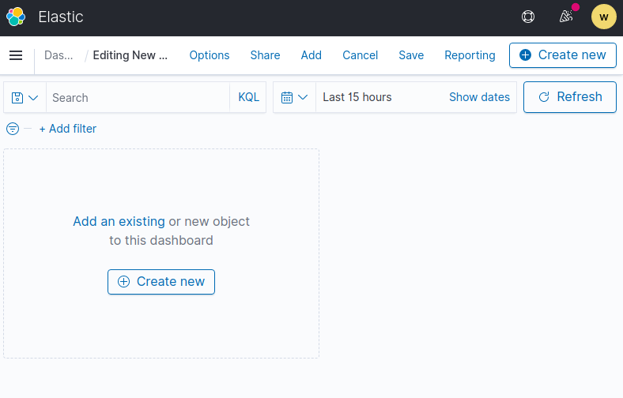

<!-----
title: "Wazuh - Antivirus and Logs"
author: "Toni Peraira"
date: "2022-02-11"
version: "1.0"
geometry: left=2.54cm,right=2.54cm,top=2.54cm,bottom=2.54cm
header-right: '\headerlogo'
header-includes:
- '`\newcommand{\headerlogo}{\raisebox{0pt}[0pt]{\includegraphics[width=3cm]{../../institut_montilivi.png}}}`{=latex}'
---

<!--
pandoc README.md -o Toni_Peraira_Antivirus_and_Logs.pdf --from markdown --template eisvogel --listings --pdf-engine=xelatex
-->

In order to work with antivirus and logs, we will add a new agent.


Agent 3.

```
OS: Microsoft Windows 10 Pro 10.0.19042
IP: 192.168.128.89
Name: B70017351361129
```

The chosen antivirus is Kaspersky, is the one that we found that best matches with the functionalities that Wazuh provide us. 

First we have to identify where are the Kaspersky logs and events. 

Unlike other antivirus, we can find his monitoring in *Windows Events Viewer > Applications and Services Logs > Kaspersky Endpoint Security*. This will be the reference of our channel in Wazuh.


The next point is add this reference in our agent *ossec.conf*. We can also add this information in the wazuh manager if we have this agent in a group.

```xml
  <localfile>
    <location>Kaspersky Endpoint Security</location>
    <log_format>eventchannel</log_format>
  </localfile>
```

Now we save and restart the Wazuh agent service.

To check if it works, we will force Kaspersky alerts that will add events that we will capture and we will be able to monitour in our Wazuh manager. We can do it accessing to these files in our navigator:

- https://secure.eicar.org/eicar.com

- https://secure.eicar.org/eicar.com.txt

- https://secure.eicar.org/eicar_com.zip

- https://secure.eicar.org/eicarcom2.zip

|                         |                         |
| ----------------------- | ----------------------- |
|  |  |
|  |  |

If we go to the *Security events* screen of our agent we can monitor these events and see the events that we force.


To see only the Kaspersky events we can add a custom filter


```json
{
  "_index": "wazuh-alerts-4.x-2022.02.15",
  "_type": "_doc",
  "_id": "rZxO_n4BMzeLMS_HizTP",
  "_version": 1,
  "_score": null,
  "_source": {
    "input": {
      "type": "log"
    },
    "agent": {
      "ip": "192.168.128.89",
      "name": "B70017351361129",
      "id": "003"
    },
    "manager": {
      "name": "Vodafone"
    },
    "data": {
      "win": {
        "eventdata": {
          "data": "Event type:     Malicious object detected Application:     Google Chrome Application\\\\Name:     chrome.exe Application\\\\Path:     C:\\\\Program Files\\\\Google\\\\Chrome\\\\Application\\\\ Application\\\\Process ID:     12640 User:     B70017351361129\\\\alum-01 (Active user) Component:     Web Threat Protection Result\\\\Description:     Detected Result\\\\Type:     Virus Result\\\\Name:     EICAR-Test-File Result\\\\Threat level:     High Result\\\\Precision:     Exactly Object:     https://secure.eicar.org/eicarcom2.zip//eicar_com.zip//eicar.com Object\\\\Type:     File Object\\\\Path:     https://secure.eicar.org/eicarcom2.zip//eicar_com.zip//eicar.com Object\\\\Name:     eicar.com Reason:     Expert analysis Database release date:     24/9/2021 13:20:00 Hash:     275a021bbfb6489e54d471899f7db9d1663fc695ec2fe2a2c4538aabf651fd0f"
        },
        "system": {
          "eventID": "302",
          "keywords": "0x80000000000000",
          "level": "2",
          "channel": "Kaspersky Endpoint Security",
          "opcode": "0",
          "message": "\"Event type:     Malicious object detected\nApplication:     Google Chrome\nApplication\\Name:     chrome.exe\nApplication\\Path:     C:\\Program Files\\Google\\Chrome\\Application\\\nApplication\\Process ID:     12640\nUser:     B70017351361129\\alum-01 (Active user)\nComponent:     Web Threat Protection\nResult\\Description:     Detected\nResult\\Type:     Virus\nResult\\Name:     EICAR-Test-File\nResult\\Threat level:     High\nResult\\Precision:     Exactly\nObject:     https://secure.eicar.org/eicarcom2.zip//eicar_com.zip//eicar.com\nObject\\Type:     File\nObject\\Path:     https://secure.eicar.org/eicarcom2.zip//eicar_com.zip//eicar.com\nObject\\Name:     eicar.com\nReason:     Expert analysis\nDatabase release date:     24/9/2021 13:20:00\nHash:     275a021bbfb6489e54d471899f7db9d1663fc695ec2fe2a2c4538aabf651fd0f\n\"",
          "version": "0",
          "systemTime": "2022-02-15T16:54:33.6036745Z",
          "eventRecordID": "545",
          "threadID": "0",
          "computer": "B70017351361129",
          "task": "0",
          "processID": "0",
          "severityValue": "ERROR",
          "providerName": "avp"
        }
      }
    },
    "rule": {
      "firedtimes": 4,
      "mail": false,
      "level": 5,
      "description": "Windows error event",
      "groups": [
        "windows",
        "system_error"
      ],
      "id": "60011",
      "gpg13": [
        "4.3"
      ],
      "gdpr": [
        "IV_35.7.d"
      ]
    },
    "location": "EventChannel",
    "decoder": {
      "name": "windows_eventchannel"
    },
    "id": "1644944065.1549830",
    "timestamp": "2022-02-15T17:54:25.635+0100"
  },
  "fields": {
    "timestamp": [
      "2022-02-15T16:54:25.635Z"
    ]
  },
  "highlight": {
    "agent.id": [
      "@kibana-highlighted-field@003@/kibana-highlighted-field@"
    ],
    "manager.name": [
      "@kibana-highlighted-field@Vodafone@/kibana-highlighted-field@"
    ]
  },
  "sort": [
    1644944065635
  ]
}
```

```json
{
  "_index": "wazuh-alerts-4.x-2022.02.15",
  "_type": "_doc",
  "_id": "rJxO_n4BMzeLMS_HhzTn",
  "_version": 1,
  "_score": null,
  "_source": {
    "input": {
      "type": "log"
    },
    "agent": {
      "ip": "192.168.128.89",
      "name": "B70017351361129",
      "id": "003"
    },
    "manager": {
      "name": "Vodafone"
    },
    "data": {
      "win": {
        "eventdata": {
          "data": "Event type:     Malicious object detected Application:     Google Chrome Application\\\\Name:     chrome.exe Application\\\\Path:     C:\\\\Program Files\\\\Google\\\\Chrome\\\\Application\\\\ Application\\\\Process ID:     12640 User:     B70017351361129\\\\alum-01 (Active user) Component:     Web Threat Protection Result\\\\Description:     Detected Result\\\\Type:     Virus Result\\\\Name:     EICAR-Test-File Result\\\\Threat level:     High Result\\\\Precision:     Exactly Object:     https://secure.eicar.org/eicar_com.zip//eicar.com Object\\\\Type:     File Object\\\\Path:     https://secure.eicar.org/eicar_com.zip//eicar.com Object\\\\Name:     eicar.com Reason:     Expert analysis Database release date:     24/9/2021 13:20:00 Hash:     275a021bbfb6489e54d471899f7db9d1663fc695ec2fe2a2c4538aabf651fd0f"
        },
        "system": {
          "eventID": "302",
          "keywords": "0x80000000000000",
          "level": "2",
          "channel": "Kaspersky Endpoint Security",
          "opcode": "0",
          "message": "\"Event type:     Malicious object detected\nApplication:     Google Chrome\nApplication\\Name:     chrome.exe\nApplication\\Path:     C:\\Program Files\\Google\\Chrome\\Application\\\nApplication\\Process ID:     12640\nUser:     B70017351361129\\alum-01 (Active user)\nComponent:     Web Threat Protection\nResult\\Description:     Detected\nResult\\Type:     Virus\nResult\\Name:     EICAR-Test-File\nResult\\Threat level:     High\nResult\\Precision:     Exactly\nObject:     https://secure.eicar.org/eicar_com.zip//eicar.com\nObject\\Type:     File\nObject\\Path:     https://secure.eicar.org/eicar_com.zip//eicar.com\nObject\\Name:     eicar.com\nReason:     Expert analysis\nDatabase release date:     24/9/2021 13:20:00\nHash:     275a021bbfb6489e54d471899f7db9d1663fc695ec2fe2a2c4538aabf651fd0f\n\"",
          "version": "0",
          "systemTime": "2022-02-15T16:54:31.8356917Z",
          "eventRecordID": "544",
          "threadID": "0",
          "computer": "B70017351361129",
          "task": "0",
          "processID": "0",
          "severityValue": "ERROR",
          "providerName": "avp"
        }
      }
    },
    "rule": {
      "firedtimes": 3,
      "mail": false,
      "level": 5,
      "description": "Windows error event",
      "groups": [
        "windows",
        "system_error"
      ],
      "id": "60011",
      "gpg13": [
        "4.3"
      ],
      "gdpr": [
        "IV_35.7.d"
      ]
    },
    "location": "EventChannel",
    "decoder": {
      "name": "windows_eventchannel"
    },
    "id": "1644944063.1545645",
    "timestamp": "2022-02-15T17:54:23.865+0100"
  },
  "fields": {
    "timestamp": [
      "2022-02-15T16:54:23.865Z"
    ]
  },
  "highlight": {
    "agent.id": [
      "@kibana-highlighted-field@003@/kibana-highlighted-field@"
    ],
    "manager.name": [
      "@kibana-highlighted-field@Vodafone@/kibana-highlighted-field@"
    ]
  },
  "sort": [
    1644944063865
  ]
}
```

```json
{
  "_index": "wazuh-alerts-4.x-2022.02.15",
  "_type": "_doc",
  "_id": "q5xO_n4BMzeLMS_HfDRN",
  "_version": 1,
  "_score": null,
  "_source": {
    "input": {
      "type": "log"
    },
    "agent": {
      "ip": "192.168.128.89",
      "name": "B70017351361129",
      "id": "003"
    },
    "manager": {
      "name": "Vodafone"
    },
    "data": {
      "win": {
        "eventdata": {
          "data": "Event type:     Malicious object detected Application:     Google Chrome Application\\\\Name:     chrome.exe Application\\\\Path:     C:\\\\Program Files\\\\Google\\\\Chrome\\\\Application\\\\ Application\\\\Process ID:     12640 User:     B70017351361129\\\\alum-01 (Active user) Component:     Web Threat Protection Result\\\\Description:     Detected Result\\\\Type:     Virus Result\\\\Name:     EICAR-Test-File Result\\\\Threat level:     High Result\\\\Precision:     Exactly Object:     https://secure.eicar.org/eicar.com.txt Object\\\\Type:     File Object\\\\Path:     https://secure.eicar.org/eicar.com.txt Object\\\\Name:     eicar.com.txt Reason:     Expert analysis Database release date:     24/9/2021 13:20:00 Hash:     275a021bbfb6489e54d471899f7db9d1663fc695ec2fe2a2c4538aabf651fd0f"
        },
        "system": {
          "eventID": "302",
          "keywords": "0x80000000000000",
          "level": "2",
          "channel": "Kaspersky Endpoint Security",
          "opcode": "0",
          "message": "\"Event type:     Malicious object detected\nApplication:     Google Chrome\nApplication\\Name:     chrome.exe\nApplication\\Path:     C:\\Program Files\\Google\\Chrome\\Application\\\nApplication\\Process ID:     12640\nUser:     B70017351361129\\alum-01 (Active user)\nComponent:     Web Threat Protection\nResult\\Description:     Detected\nResult\\Type:     Virus\nResult\\Name:     EICAR-Test-File\nResult\\Threat level:     High\nResult\\Precision:     Exactly\nObject:     https://secure.eicar.org/eicar.com.txt\nObject\\Type:     File\nObject\\Path:     https://secure.eicar.org/eicar.com.txt\nObject\\Name:     eicar.com.txt\nReason:     Expert analysis\nDatabase release date:     24/9/2021 13:20:00\nHash:     275a021bbfb6489e54d471899f7db9d1663fc695ec2fe2a2c4538aabf651fd0f\n\"",
          "version": "0",
          "systemTime": "2022-02-15T16:54:29.0471847Z",
          "eventRecordID": "543",
          "threadID": "0",
          "computer": "B70017351361129",
          "task": "0",
          "processID": "0",
          "severityValue": "ERROR",
          "providerName": "avp"
        }
      }
    },
    "rule": {
      "firedtimes": 2,
      "mail": false,
      "level": 5,
      "description": "Windows error event",
      "groups": [
        "windows",
        "system_error"
      ],
      "id": "60011",
      "gpg13": [
        "4.3"
      ],
      "gdpr": [
        "IV_35.7.d"
      ]
    },
    "location": "EventChannel",
    "decoder": {
      "name": "windows_eventchannel"
    },
    "id": "1644944061.1541532",
    "timestamp": "2022-02-15T17:54:21.162+0100"
  },
  "fields": {
    "timestamp": [
      "2022-02-15T16:54:21.162Z"
    ]
  },
  "highlight": {
    "agent.id": [
      "@kibana-highlighted-field@003@/kibana-highlighted-field@"
    ],
    "manager.name": [
      "@kibana-highlighted-field@Vodafone@/kibana-highlighted-field@"
    ]
  },
  "sort": [
    1644944061162
  ]
}
```

```json
{
  "_index": "wazuh-alerts-4.x-2022.02.15",
  "_type": "_doc",
  "_id": "ppxM_n4BMzeLMS_HuzQY",
  "_version": 1,
  "_score": null,
  "_source": {
    "input": {
      "type": "log"
    },
    "agent": {
      "ip": "192.168.128.89",
      "name": "B70017351361129",
      "id": "003"
    },
    "manager": {
      "name": "Vodafone"
    },
    "data": {
      "win": {
        "eventdata": {
          "data": "Event type:     Malicious object detected Application:     Google Chrome Application\\\\Name:     chrome.exe Application\\\\Path:     C:\\\\Program Files\\\\Google\\\\Chrome\\\\Application\\\\ Application\\\\Process ID:     12640 User:     B70017351361129\\\\alum-01 (Active user) Component:     Web Threat Protection Result\\\\Description:     Detected Result\\\\Type:     Virus Result\\\\Name:     EICAR-Test-File Result\\\\Threat level:     High Result\\\\Precision:     Exactly Object:     https://secure.eicar.org/eicar.com Object\\\\Type:     File Object\\\\Path:     https://secure.eicar.org/eicar.com Object\\\\Name:     eicar.com Reason:     Expert analysis Database release date:     24/9/2021 13:20:00 Hash:     275a021bbfb6489e54d471899f7db9d1663fc695ec2fe2a2c4538aabf651fd0f"
        },
        "system": {
          "eventID": "302",
          "keywords": "0x80000000000000",
          "level": "2",
          "channel": "Kaspersky Endpoint Security",
          "opcode": "0",
          "message": "\"Event type:     Malicious object detected\nApplication:     Google Chrome\nApplication\\Name:     chrome.exe\nApplication\\Path:     C:\\Program Files\\Google\\Chrome\\Application\\\nApplication\\Process ID:     12640\nUser:     B70017351361129\\alum-01 (Active user)\nComponent:     Web Threat Protection\nResult\\Description:     Detected\nResult\\Type:     Virus\nResult\\Name:     EICAR-Test-File\nResult\\Threat level:     High\nResult\\Precision:     Exactly\nObject:     https://secure.eicar.org/eicar.com\nObject\\Type:     File\nObject\\Path:     https://secure.eicar.org/eicar.com\nObject\\Name:     eicar.com\nReason:     Expert analysis\nDatabase release date:     24/9/2021 13:20:00\nHash:     275a021bbfb6489e54d471899f7db9d1663fc695ec2fe2a2c4538aabf651fd0f\n\"",
          "version": "0",
          "systemTime": "2022-02-15T16:52:34.8645210Z",
          "eventRecordID": "542",
          "threadID": "0",
          "computer": "B70017351361129",
          "task": "0",
          "processID": "0",
          "severityValue": "ERROR",
          "providerName": "avp"
        }
      }
    },
    "rule": {
      "firedtimes": 1,
      "mail": false,
      "level": 5,
      "description": "Windows error event",
      "groups": [
        "windows",
        "system_error"
      ],
      "id": "60011",
      "gpg13": [
        "4.3"
      ],
      "gdpr": [
        "IV_35.7.d"
      ]
    },
    "location": "EventChannel",
    "decoder": {
      "name": "windows_eventchannel"
    },
    "id": "1644943946.1537467",
    "timestamp": "2022-02-15T17:52:26.895+0100"
  },
  "fields": {
    "timestamp": [
      "2022-02-15T16:52:26.895Z"
    ]
  },
  "highlight": {
    "agent.id": [
      "@kibana-highlighted-field@003@/kibana-highlighted-field@"
    ],
    "manager.name": [
      "@kibana-highlighted-field@Vodafone@/kibana-highlighted-field@"
    ]
  },
  "sort": [
    1644943946895
  ]
}
```








