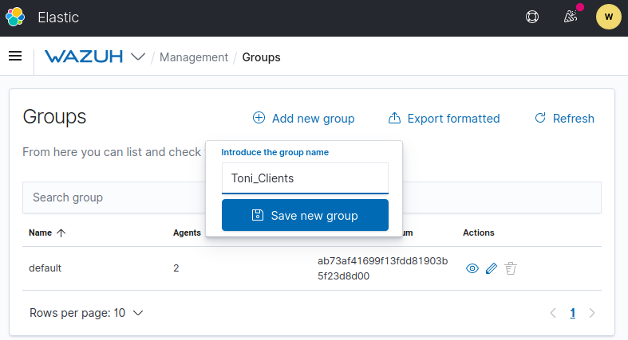
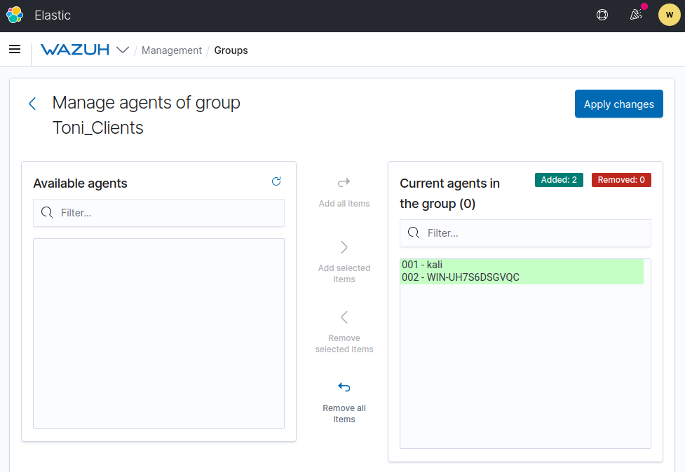
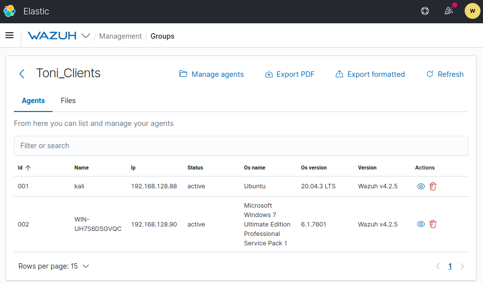
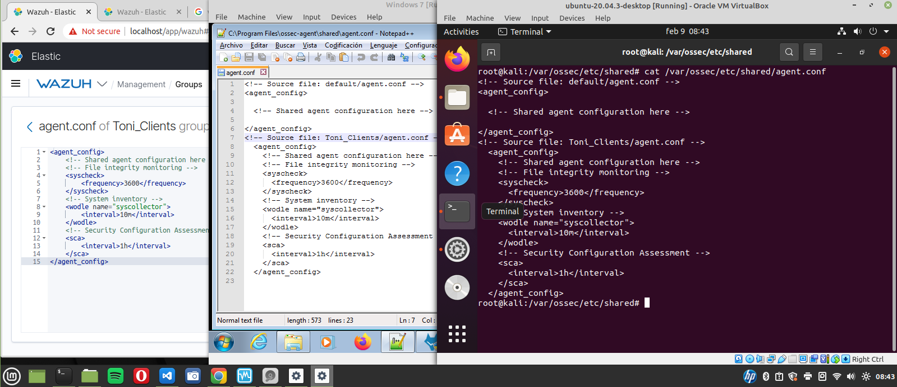
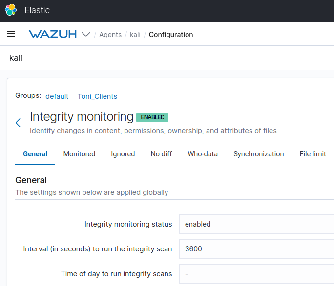

<!-----
title: "Wazuh - Centralized Agent Configuration"
author: "Toni Peraira"
date: "2022-02-04"
version: "1.0"
geometry: left=2.54cm,right=2.54cm,top=2.54cm,bottom=2.54cm
header-right: '\headerlogo'
header-includes:
- '`\newcommand{\headerlogo}{\raisebox{0pt}[0pt]{\includegraphics[width=3cm]{../../institut_montilivi.png}}}`{=latex}'
---

<!--
pandoc README.md -o Toni_Peraira_Wazuh_Centralized_Agent_Configuration.pdf --from markdown --template eisvogel --listings --pdf-engine=xelatex
-->

# Manage groups

We can create agent groups in order to centralize our machines and keep Wazuh organizated.

When we have a group, we can apply changes to agent config remotely, which allow us to avoid connecting to our agents each time we need changes.

First create the group.



Then we will add agents to the group.



From here we can view and manage the agents.



We will add this configuration to all of our agents.

```xml
<agent_config>
	<!-- Shared agent configuration here -->
	<!-- File integrity monitoring -->
	<syscheck>
	    <frequency>3600</frequency>
	</syscheck>
	<!-- System inventory -->
    <wodle name="syscollector">
      <interval>10m</interval>
    </wodle>
    <!-- Security Configuration Assessment -->
    <sca>
        <interval>1h</interval>
    </sca>
</agent_config>
```

When we apply changes, the agent shared config will be automatically updated as we can see in the next figure, where we see the wazuh manager and the two agents.



Finally the changes will be visibles in our portal.


