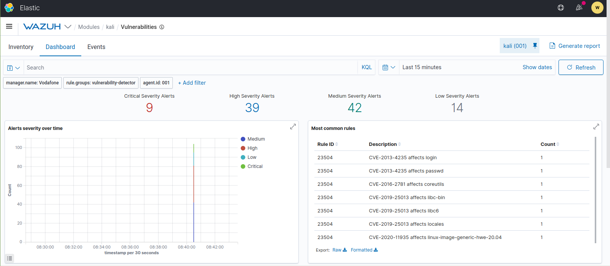

<!------
title: "Wazuh - Vulnerability Detection"
author: "Toni Peraira"
date: "2022-02-04"
version: "1.0"
geometry: left=2.54cm,right=2.54cm,top=2.54cm,bottom=2.54cm
header-right: '\headerlogo'
header-includes:
- '`\newcommand{\headerlogo}{\raisebox{0pt}[0pt]{\includegraphics[width=3cm]{../../institut_montilivi.png}}}`{=latex}'
---

<!--
pandoc README.md -o Toni_Peraira_Wazuh_Vulnerability_Detection.pdf --from markdown --template eisvogel --listings --pdf-engine=xelatex --toc -s -V toc-title:"Index"
-->

# System Info

We will use a machine as Wazuh's manager and two agents.

Manager machine.

```
OS: Linux Mint 20 (Ulyana)
IP: 192.168.128.87
Name: Vodafone
```

Agent 1.

```
OS: Ubuntu 20.04.3 Desktop
IP: 192.168.128.88
Name: kali
```

Agent 2.

```
OS: Windows 7
IP: 192.168.128.89
Name: WIN-UH7S6DSGVQC
```

# Installation

## Manager machine

Install wazuh manager as root.

``` 
$ curl -so ~/unattended-installation.sh https://packages.wazuh.com/resources/4.2/open-distro/unattended-installation/unattended-installation.sh && bash ~/unattended-installation.sh -o
```

Edit ossec.conf in order to enable vulnerability detector.

```
$ sudo vim /var/ossec/etc/ossec.conf

  <vulnerability-detector>
    <enabled>yes</enabled>
    <interval>5m</interval>
    <ignore_time>6h</ignore_time>
    <run_on_start>yes</run_on_start>

    <!-- Ubuntu OS vulnerabilities --> 
    <provider name="canonical">
      <enabled>yes</enabled>
      <os>trusty</os>
      <os>xenial</os>
      <os>bionic</os>
      <os>focal</os>
      <update_interval>1h</update_interval>
    </provider>

    <!-- Debian OS vulnerabilities -->  
    <provider name="debian">
      <enabled>no</enabled>
      <os>stretch</os>
      <os>buster</os>
      <update_interval>1h</update_interval>
    </provider>

    <!-- RedHat OS vulnerabilities -->  
    <provider name="redhat">
      <enabled>no</enabled>
      <os>5</os>
      <os>6</os>
      <os>7</os>
      <os>8</os>
      <update_interval>1h</update_interval>
    </provider>

    <!-- Windows OS vulnerabilities -->
    <provider name="msu">
      <enabled>yes</enabled>
      <update_interval>1h</update_interval>
    </provider>

    <!-- Aggregate vulnerabilities -->
    <provider name="nvd">
      <enabled>yes</enabled>
      <update_from_year>2010</update_from_year>
      <update_interval>1h</update_interval>
    </provider>

  </vulnerability-detector>
```

Restart service.

```bash 
$ sudo systemctl restart wazuh-manager
```

## Agent 1 - kali

Install wazuh-agent.

```
$ WAZUH_MANAGER="192.168.128.87" apt-get install wazuh-agent
```

Make sure agent points correctly to our server and enable system inventory.

```
$ sudo vim /var/ossec/etc/ossec.conf

  <client>
    <server>
      <address>192.168.128.87</address>
      <port>1514</port>
      <protocol>tcp</protocol>
    </server>
    <config-profile>ubuntu, ubuntu20, ubuntu20.04</config-profile>
    <notify_time>10</notify_time>
    <time-reconnect>60</time-reconnect>
    <auto_restart>yes</auto_restart>
    <crypto_method>aes</crypto_method>
  </client>


  <!-- System inventory -->
  <wodle name="syscollector">
    <disabled>no</disabled>
    <interval>1h</interval>
    <scan_on_start>yes</scan_on_start>
    <hardware>yes</hardware>
    <os>yes</os>
    <network>yes</network>
    <packages>yes</packages>
    <ports all="no">yes</ports>
    <processes>yes</processes>

    <!-- Database synchronization settings -->
    <synchronization>
      <max_eps>10</max_eps>
    </synchronization>
  </wodle>
```

## Agent 2 - WIN-UH7S6DSGVQC

Install wazuh agent from his website [https://packages.wazuh.com/4.x/windows/wazuh-agent-4.2.5-1.msi](https://packages.wazuh.com/4.x/windows/wazuh-agent-4.2.5-1.msi).

Edit ossec config *C:/Program Files/ossec-agent/ossec.conf* to make sure agent points correctly to our server and enable system inventory.

```
  <client>
    <server>
      <address>192.168.128.87</address>
      <port>1514</port>
      <protocol>tcp</protocol>
    </server>
    <crypto_method>aes</crypto_method>
    <notify_time>10</notify_time>
    <time-reconnect>60</time-reconnect>
    <auto_restart>yes</auto_restart>
  </client>


  <!-- System inventory -->
  <wodle name="syscollector">
    <disabled>no</disabled>
    <interval>1h</interval>
    <scan_on_start>yes</scan_on_start>
    <hardware>yes</hardware>
    <os>yes</os>
    <network>yes</network>
    <packages>yes</packages>
    <ports all="no">yes</ports>
    <processes>yes</processes>
    <hotfixes>yes</hotfixes>

    <!-- Database synchronization settings -->
    <synchronization>
      <max_eps>10</max_eps>
    </synchronization>
  </wodle>
```

Finally restart Wazuh service in our Windows agent.


## Agents dashboard

After the synchronization of the agents with the manager we can acces to our Wazuh from [https://localhost/](https://localhost/) in our server machine.


# Vulnerabilities

We got the task of check all critical vulnerabilities and try to fix them.

## Agent 1 - Kali


As we can se, our agent 1 has 63 critical vulnerabilities. 

Some of them still don't have fix, or is not recommended. Most packages are already at the latest version available in official repositories, our agent has the latest Ubuntu version.

Even if we have the latest packages from official repositories, it does not mean that are the latest from their creators. In order to install these packages, we have to download it from creator website or github, make a manual compilation and installation. In many cases is not recommended because the installation may cause destabilizations in our system, maybe becuase are core package or is not prepared correctly.

Critical vulnerabilities detected:

```
"Rule ID",Description,Count
23506,"CVE-2016-1585 affects apparmor",1
23506,"CVE-2016-1585 affects libapparmor1",1
23506,"CVE-2021-29921 affects libpython3.8",1
23506,"CVE-2021-29921 affects libpython3.8-minimal",1
23506,"CVE-2021-29921 affects libpython3.8-stdlib",1
23506,"CVE-2021-29921 affects python3.8",1
23506,"CVE-2021-29921 affects python3.8-minimal",1
23506,"CVE-2021-30498 affects libcaca0",1
23506,"CVE-2021-30499 affects libcaca0",1
23506,"CVE-2021-31870 affects klibc-utils",1
23506,"CVE-2021-31870 affects libklibc",1
23506,"CVE-2021-31873 affects klibc-utils",1
23506,"CVE-2021-31873 affects libklibc",1
23506,"CVE-2021-32810 affects firefox",1
23506,"CVE-2021-34552 affects python3-pil",1
23506,"CVE-2021-35942 affects libc-bin",1
23506,"CVE-2021-35942 affects libc6",1
23506,"CVE-2021-35942 affects locales",1
23506,"CVE-2021-3711 affects libssl1.1",1
23506,"CVE-2021-3711 affects openssl",1
```

Upgrade packages.

```
kali@kali:~$ sudo apt autoremove -y
kali@kali:~$ sudo apt-get update -y -y
kali@kali:~$ sudo apt-get upgrade -y
```

### [CVE-2016-1585](https://cve.mitre.org/cgi-bin/cvename.cgi?name=CVE-2016-1585)

In all versions of AppArmor mount rules are accidentally widened when compiled.

```
Apparently there is no fix.
```

### [CVE-2021-29921](https://cve.mitre.org/cgi-bin/cvename.cgi?name=CVE-2021-29921)

In Python before 3,9,5, the ipaddress library mishandles leading zero characters in the octets of an IP address string. This (in some situations) allows attackers to bypass access control that is based on IP addresses.

```bash
# Install latest python and make sure it is the one you will use by default.
kali@kali:~$ python3 --version
Python 3.8.10
kali@kali:~$ sudo add-apt-repository ppa:deadsnakes/ppa
kali@kali:~$ sudo apt update
kali@kali:~$ sudo apt install -y python3.10
kali@kali:~$ sudo update-alternatives --set python3 /usr/bin/python3.10
kali@kali:~$ python3 --version
Python 3.10.2
kali@kali:~$ sudo apt-get remove  python3-apt
kali@kali:~$ sudo apt-get install python3-apt
kali@kali:~$ sudo apt-get install --reinstall python3-apt
```

### [CVE-2021-30498](https://cve.mitre.org/cgi-bin/cvename.cgi?name=CVE-2021-30498)

A flaw was found in libcaca. A heap buffer overflow in export.c in function export_tga might lead to memory corruption and other potential consequences.

Fixed in [https://github.com/cacalabs/libcaca/commit/ab04483ee1a846d6b74b2e6248e980152baec3f6](https://github.com/cacalabs/libcaca/commit/ab04483ee1a846d6b74b2e6248e980152baec3f6).

```bash
# Compile and install manually 'autoconf' dependency.
kali@kali:/opt$ sudo wget http://ftp.gnu.org/gnu/autoconf/autoconf-latest.tar.gz --no-check-certificate
kali@kali:/opt$ sudo tar -xzvf autoconf-latest.tar.gz 
kali@kali:/opt$ cd autoconf-2.71/
kali@kali:/opt/autoconf-2.71$ sudo ./configure 
kali@kali:/opt/autoconf-2.71$ sudo make
kali@kali:/opt/autoconf-2.71$ sudo make install
```

```bash
# Compile and install manually 'libcaca' package.
kali@kali:/opt$ sudo wget https://github.com/cacalabs/libcaca/archive/refs/heads/main.zip --no-check-certificate
kali@kali:/opt$ sudo unzip main.zip 
kali@kali:/opt/libcaca-main$ sudo apt-get install libtool
kali@kali:/opt/libcaca-main$ sudo ./bootstrap 
kali@kali:/opt/libcaca-main$ sudo ./configure 
kali@kali:/opt/libcaca-main$ sudo make
kali@kali:/opt/libcaca-main$ sudo make install
```

### [CVE-2021-30499](https://cve.mitre.org/cgi-bin/cvename.cgi?name=CVE-2021-30499)

A flaw was found in libcaca. A buffer overflow of export.c in function export_troff might lead to memory corruption and other potential consequences.

Fixed in [CVE-2021-30498](#CVE-2021-30498).


### [CVE-2021-31870](https://cve.mitre.org/cgi-bin/cvename.cgi?name=CVE-2021-31870)

An issue was discovered in klibc before 2.0.9. Multiplication in the calloc() function may result in an integer overflow and a subsequent heap buffer overflow.

Fixed in new versions of klibc but as the creator README says 'The build procedure is not very polished yet' so we do not recommend this installation.

```bash
# Get libklibc current version.
kali@kali:/opt$ dpkg -l | grep libklibc
libklibc:amd64                             2.0.7-1ubuntu5  

# Trying to install latest version, but it already is.
kali@kali:/opt$ sudo apt upgrade -y klibc-utils
kali@kali:/opt$ sudo apt-get upgrade -y libklibc

# Download latest version.
kali@kali:/opt$ wget https://git.kernel.org/pub/scm/libs/klibc/klibc.git/snapshot/klibc-2.0.10.tar.gz --no-check-certificate
kali@kali:/opt$ tar -xzvf klibc-2.0.10.tar.gz
kali@kali:/opt$ cd klibc-2.0.10/
kali@kali:/opt/klibc-2.0.10$ cat usr/klibc/README.klibc 

The build procedure is not very polished yet

kali@kali:/opt/klibc-2.0.10$ apt search linux-headers-$(uname -r)
kali@kali:/opt/klibc-2.0.10$ sudo apt install -y linux-source
kali@kali:/opt/klibc-2.0.10$ make headers_install INSTALL_HDR_PATH=/usr/src/klibc/linux
kali@kali:/opt/klibc-2.0.10$ ln -s /usr/src/linux-headers-5.13.0-28-generic /opt/klibc-2.0.10/linux
```

### [CVE-2021-31873](https://cve.mitre.org/cgi-bin/cvename.cgi?name=CVE-2021-31873)

An issue was discovered in klibc before 2.0.9. Additions in the malloc() function may result in an integer overflow and a subsequent heap buffer overflow.

Related to [CVE-2021-31870](#CVE-2021-31870).

### [CVE-2021-32810](https://cve.mitre.org/cgi-bin/cvename.cgi?name=CVE-2021-32810)

crossbeam-deque is a package of work-stealing deques for building task schedulers when programming in Rust. In versions prior to 0.7.4 and 0.8.0, the result of the race condition is that one or more tasks in the worker queue can be popped twice instead of other tasks that are forgotten and never popped. If tasks are allocated on the heap, this can cause double free and a memory leak. If not, this still can cause a logical bug. Crates using `Stealer::steal`, `Stealer::steal_batch`, or `Stealer::steal_batch_and_pop` are affected by this issue. This has been fixed in crossbeam-deque 0.8.1 and 0.7.4.

```
Fixed in our first package upgrade.
```

### [CVE-2021-34552](https://cve.mitre.org/cgi-bin/cvename.cgi?name=CVE-2021-34552)

Pillow through 8.2.0 and PIL (aka Python Imaging Library) through 1.1.7 allow an attacker to pass controlled parameters directly into a convert function to trigger a buffer overflow in Convert.c.

```
Fixed in our first package upgrade.
```

### [CVE-2021-35942](https://cve.mitre.org/cgi-bin/cvename.cgi?name=CVE-2021-35942)

The wordexp function in the GNU C Library (aka glibc) through 2.33 may crash or read arbitrary memory in parse_param (in posix/wordexp.c) when called with an untrusted, crafted pattern, potentially resulting in a denial of service or disclosure of information. This occurs because atoi was used but strtoul should have been used to ensure correct calculations.

We don't recommend upgrading the GNU C Library because it's  core library and it will generate inconsistencies, 100% sure. This update has to come with the system.

It can be installed manually this way.

```
kali@kali:~$ ldd --version
ldd (Ubuntu GLIBC 2.31-0ubuntu9.2) 2.31
Copyright (C) 2020 Free Software Foundation, Inc.
This is free software; see the source for copying conditions.  There is NO
warranty; not even for MERCHANTABILITY or FITNESS FOR A PARTICULAR PURPOSE.
Written by Roland McGrath and Ulrich Drepper.
kali@kali:~$ cd /opt
kali@kali:/opt$ sudo wget https://ftp.gnu.org/gnu/glibc/glibc-2.35.tar.gz --no-check-certificate
kali@kali:/opt$ sudo tar -xzvf glibc-2.35.tar.gz 
kali@kali:/opt$ sudo mkdir -p glibc-2.35/build
kali@kali:/opt$ cd glibc-2.35/build/
kali@kali:/opt/glibc-2.35/build$ sudo apt install -y bison
kali@kali:/opt/glibc-2.35/build$ sudo apt install -y gawk
kali@kali:/opt/glibc-2.34/build$ sudo apt-get install -y texinfo
kali@kali:/opt/glibc-2.35/build$ sudo ../configure --prefix=/opt/glibc-2.35
kali@kali:/opt/glibc-2.35/build$ sudo make -j4
kali@kali:/opt/glibc-2.35/build$ sudo make test
kali@kali:/opt/glibc-2.35/build$ sudo make install
kali@kali:/opt/glibc-2.34/build$ export LD_LIBRARY_PATH=/opt/glibc-2.34/lib
```

Now we got our GNU C Library at the latest version but is working at the same time as the other version, making such inconsistencies that is impossible to work, is mandatory to remove the previous version but many dependencies will stop working.

### [CVE-2021-3711](https://cve.mitre.org/cgi-bin/cvename.cgi?name=CVE-2021-3711)

In order to decrypt SM2 encrypted data an application is expected to call the API function EVP_PKEY_decrypt(). Typically an application will call this function twice. The first time, on entry, the "out" parameter can be NULL and, on exit, the "outlen" parameter is populated with the buffer size required to hold the decrypted plaintext. The application can then allocate a sufficiently sized buffer and call EVP_PKEY_decrypt() again, but this time passing a non-NULL value for the "out" parameter. A bug in the implementation of the SM2 decryption code means that the calculation of the buffer size required to hold the plaintext returned by the first call to EVP_PKEY_decrypt() can be smaller than the actual size required by the second call. This can lead to a buffer overflow when EVP_PKEY_decrypt() is called by the application a second time with a buffer that is too small. A malicious attacker who is able present SM2 content for decryption to an application could cause attacker chosen data to overflow the buffer by up to a maximum of 62 bytes altering the contents of other data held after the buffer, possibly changing application behaviour or causing the application to crash. The location of the buffer is application dependent but is typically heap allocated. Fixed in OpenSSL 1.1.1l (Affected 1.1.1-1.1.1k).

```bash
kali@kali:/opt$ openssl version
OpenSSL 1.1.1f  31 Mar 2020

# Backup old openssl
kali@kali:/opt$ sudo mv /usr/bin/openssl /usr/bin/openssl.old 

# Compile and install manually 'openssl' package.
kali@kali:/opt$ sudo wget https://www.openssl.org/source/openssl-1.1.1m.tar.gz --no-check-certificate
kali@kali:/opt$ sudo tar -xf openssl-1.1.1m.tar.gz
kali@kali:/opt$ cd openssl-1.1.1m/

kali@kali:/opt/openssl-1.1.1m$ sudo ./config
Operating system: x86_64-whatever-linux2
Configuring OpenSSL version 1.1.1m (0x101010dfL) for linux-x86_64
Using os-specific seed configuration
Creating configdata.pm
Creating Makefile

**********************************************************************
***                                                                ***
***   OpenSSL has been successfully configured                     ***
***                                                                ***
***   If you encounter a problem while building, please open an    ***
***   issue on GitHub <https://github.com/openssl/openssl/issues>  ***
***   and include the output from the following command:           ***
***                                                                ***
***       perl configdata.pm --dump                                ***
***                                                                ***
***   (If you are new to OpenSSL, you might want to consult the    ***
***   'Troubleshooting' section in the INSTALL file first)         ***
***                                                                ***
**********************************************************************

# Install dependencies.
kali@kali:/opt/openssl-1.1.1m$ sudo apt-get install -y build-essential
kali@kali:/opt/openssl-1.1.1m$ sudo apt-get install -y libz-dev

kali@kali:/opt/openssl-1.1.1m$ sudo make
kali@kali:/opt/openssl-1.1.1m$ sudo make test
kali@kali:/opt/openssl-1.1.1m$ sudo make install
kali@kali:/opt/openssl-1.1.1m$ which openssl
/usr/bin/openssl
kali@kali:~/openssl-1.1.1m$ sudo mv ~/openssl-1.1.1m /opt/openssl-1.1.1m
kali@kali:~/openssl-1.1.1m$ sudo ln -s /usr/local/bin/openssl /usr/bin/openssl
kali@kali:/opt/openssl-1.1.1m$ sudo ldconfig
kali@kali:/opt/openssl-1.1.1m$ openssl version
OpenSSL 1.1.1m  14 Dec 2021
```



## Agent 2 - WIN-UH7S6DSGVQC


Critical vulnerabilities detected:

```
"Rule ID",Description,Count
23505,"CVE-2016-2808 affects Mozilla Firefox 45.0.2 (x86 es-ES)",2
23505,"CVE-2016-2811 affects Mozilla Firefox 45.0.2 (x86 es-ES)",2
23505,"CVE-2016-2812 affects Mozilla Firefox 45.0.2 (x86 es-ES)",2
23505,"CVE-2016-2818 affects Mozilla Firefox 45.0.2 (x86 es-ES)",2
23505,"CVE-2016-2828 affects Mozilla Firefox 45.0.2 (x86 es-ES)",2
23505,"CVE-2016-5272 affects Mozilla Firefox 45.0.2 (x86 es-ES)",2
23505,"CVE-2016-5275 affects Mozilla Firefox 45.0.2 (x86 es-ES)",2
23505,"CVE-2016-5283 affects Mozilla Firefox 45.0.2 (x86 es-ES)",2
23505,"CVE-2016-5284 affects Mozilla Firefox 45.0.2 (x86 es-ES)",2
23505,"CVE-2016-9066 affects Mozilla Firefox 45.0.2 (x86 es-ES)",2
23505,"CVE-2016-9894 affects Mozilla Firefox 45.0.2 (x86 es-ES)",2
23505,"CVE-2016-9902 affects Mozilla Firefox 45.0.2 (x86 es-ES)",2
23505,"CVE-2017-5379 affects Mozilla Firefox 45.0.2 (x86 es-ES)",2
23505,"CVE-2017-5382 affects Mozilla Firefox 45.0.2 (x86 es-ES)",2
23505,"CVE-2017-5421 affects Mozilla Firefox 45.0.2 (x86 es-ES)",2
23505,"CVE-2017-5422 affects Mozilla Firefox 45.0.2 (x86 es-ES)",2
23505,"CVE-2017-5436 affects Mozilla Firefox 45.0.2 (x86 es-ES)",2
23505,"CVE-2017-5449 affects Mozilla Firefox 45.0.2 (x86 es-ES)",2
23505,"CVE-2017-7752 affects Mozilla Firefox 45.0.2 (x86 es-ES)",2
23505,"CVE-2017-7754 affects Mozilla Firefox 45.0.2 (x86 es-ES)",2
23504,"CVE-2016-2816 affects Mozilla Firefox 45.0.2 (x86 es-ES)",2
23504,"CVE-2016-2817 affects Mozilla Firefox 45.0.2 (x86 es-ES)",2
23504,"CVE-2016-2820 affects Mozilla Firefox 45.0.2 (x86 es-ES)",2
23504,"CVE-2016-2822 affects Mozilla Firefox 45.0.2 (x86 es-ES)",2
23504,"CVE-2016-2825 affects Mozilla Firefox 45.0.2 (x86 es-ES)",2
23504,"CVE-2016-2827 affects Mozilla Firefox 45.0.2 (x86 es-ES)",2
23504,"CVE-2016-2829 affects Mozilla Firefox 45.0.2 (x86 es-ES)",2
23504,"CVE-2016-2830 affects Mozilla Firefox 45.0.2 (x86 es-ES)",2
23504,"CVE-2016-2832 affects Mozilla Firefox 45.0.2 (x86 es-ES)",2
23504,"CVE-2016-2833 affects Mozilla Firefox 45.0.2 (x86 es-ES)",2
23504,"CVE-2016-2837 affects Mozilla Firefox 45.0.2 (x86 es-ES)",2
23504,"CVE-2016-5250 affects Mozilla Firefox 45.0.2 (x86 es-ES)",2
23504,"CVE-2016-5251 affects Mozilla Firefox 45.0.2 (x86 es-ES)",2
23504,"CVE-2016-5253 affects Mozilla Firefox 45.0.2 (x86 es-ES)",2
23504,"CVE-2016-5260 affects Mozilla Firefox 45.0.2 (x86 es-ES)",2
23504,"CVE-2016-5268 affects Mozilla Firefox 45.0.2 (x86 es-ES)",2
23504,"CVE-2016-9064 affects Mozilla Firefox 45.0.2 (x86 es-ES)",2
23504,"CVE-2016-9074 affects Mozilla Firefox 45.0.2 (x86 es-ES)",2
23504,"CVE-2017-5383 affects Mozilla Firefox 45.0.2 (x86 es-ES)",2
23504,"CVE-2017-5384 affects Mozilla Firefox 45.0.2 (x86 es-ES)",2
23506,"CVE-2016-5280 affects Mozilla Firefox 45.0.2 (x86 es-ES)",4
23506,"CVE-2016-5281 affects Mozilla Firefox 45.0.2 (x86 es-ES)",4
23506,"CVE-2016-0718 affects Mozilla Firefox 45.0.2 (x86 es-ES)",2
23506,"CVE-2016-5254 affects Mozilla Firefox 45.0.2 (x86 es-ES)",2
23506,"CVE-2016-5256 affects Mozilla Firefox 45.0.2 (x86 es-ES)",2
23506,"CVE-2016-5257 affects Mozilla Firefox 45.0.2 (x86 es-ES)",2
23506,"CVE-2016-5270 affects Mozilla Firefox 45.0.2 (x86 es-ES)",2
23506,"CVE-2016-5274 affects Mozilla Firefox 45.0.2 (x86 es-ES)",2
23506,"CVE-2016-5276 affects Mozilla Firefox 45.0.2 (x86 es-ES)",2
23506,"CVE-2016-5277 affects Mozilla Firefox 45.0.2 (x86 es-ES)",2
23506,"CVE-2016-5287 affects Mozilla Firefox 45.0.2 (x86 es-ES)",2
23506,"CVE-2016-5289 affects Mozilla Firefox 45.0.2 (x86 es-ES)",2
23506,"CVE-2016-5290 affects Mozilla Firefox 45.0.2 (x86 es-ES)",2
23506,"CVE-2016-5297 affects Mozilla Firefox 45.0.2 (x86 es-ES)",2
23506,"CVE-2016-9063 affects Mozilla Firefox 45.0.2 (x86 es-ES)",2
23506,"CVE-2016-9075 affects Mozilla Firefox 45.0.2 (x86 es-ES)",2
23506,"CVE-2016-9080 affects Mozilla Firefox 45.0.2 (x86 es-ES)",2
23506,"CVE-2016-9893 affects Mozilla Firefox 45.0.2 (x86 es-ES)",2
23506,"CVE-2016-9898 affects Mozilla Firefox 45.0.2 (x86 es-ES)",2
23506,"CVE-2016-9899 affects Mozilla Firefox 45.0.2 (x86 es-ES)",2
23503,"CVE-2017-5387 affects Mozilla Firefox 45.0.2 (x86 es-ES)",2
23503,"CVE-2019-11743 affects Mozilla Firefox 45.0.2 (x86 es-ES)",2
23503,"CVE-2020-12394 affects Mozilla Firefox 45.0.2 (x86 es-ES)",2
23503,"CVE-2020-6824 affects Mozilla Firefox 45.0.2 (x86 es-ES)",2
23503,"CVE-2021-24000 affects Mozilla Firefox 45.0.2 (x86 es-ES)",2
23503,"CVE-2016-0175 affects Windows 7",1
23503,"CVE-2016-3251 affects Windows 7",1
23503,"CVE-2016-3354 affects Windows 7",1
23503,"CVE-2016-7214 affects Windows 7",1
23503,"CVE-2017-0042 affects Windows 7",1
23503,"CVE-2017-0096 affects Windows 7",1
23503,"CVE-2017-8676 affects Windows 7",1
23503,"CVE-2018-0878 affects Windows 7",1
23503,"CVE-2018-8481 affects Windows 7",1
23503,"CVE-2018-8482 affects Windows 7",1
23503,"CVE-2019-1418 affects Windows 7",1
23503,"CVE-2019-1488 affects Windows 7",1
23503,"CVE-2020-24588 affects Windows 7",1
```

Most vulnerabilities come from having an outdated Mozilla Firefox 45.0.2. We will update it to the latest version.


Now we only have vulnerabilities associated to our operative system.


